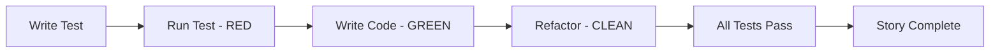

# {{Project Name}} Work Plan & Progress Tracking

## Overview

This document breaks down the Epics defined in the PRD (`template_00_prd.md`) into detailed, actionable stories. Each story represents a vertical slice of functionality that can be implemented by an AI agent in a single focused session **using Test-Driven Development (TDD) methodology**.

**Key Principles:**
- Every story must deliver working, testable functionality
- Stories follow TDD Red-Green-Refactor cycle
- Stories are sequentially ordered within each Epic
- Each story includes comprehensive test scenarios and pass criteria
- Stories are sized for single AI agent execution (2-4 hours of work)
- Test-first approach ensures quality delivery

## Test-Driven Development (TDD) Framework

### TDD Workflow for Each Story


### Test Categories
- **Unit Tests:** Individual function/method testing
- **Integration Tests:** Component interaction testing
- **End-to-End Tests:** Full workflow testing
- **Performance Tests:** Response time and throughput testing
- **Security Tests:** Access control and data protection testing
- **Acceptance Tests:** Business requirement validation

### Test Coverage Requirements
- **Unit Test Coverage:** Minimum 80% code coverage
- **Integration Test Coverage:** All API endpoints and database operations
- **Critical Path Coverage:** 100% coverage for core business logic
- **Performance Benchmarks:** All performance criteria must be validated

## Epic Progress Summary

| Epic | Status | Stories Complete | Total Stories | % Complete |
|------|--------|------------------|---------------|------------|
| Epic 1: {{Epic Title}} | {{Status}} | {{X}} | {{Y}} | {{Z%}} |
| Epic 2: {{Epic Title}} | {{Status}} | {{X}} | {{Y}} | {{Z%}} |
| Epic 3: {{Epic Title}} | {{Status}} | {{X}} | {{Y}} | {{Z%}} |

**Overall Project Status:** {{X}}/{{Y}} stories complete ({{Z%}})

## Epic 1: {{Epic Title}}

**Goal:** {{Epic goal from PRD}}
**Status:** {{Todo/In Progress/Complete}}
**Architecture Dependencies:** {{Reference relevant architecture components}}

### Story 1.1: {{Story Title}}

**Status:** {{Todo/In Progress/Complete/Blocked}}
**Assigned Session:** {{Session date or "Unassigned"}}
**Estimated Effort:** {{Small/Medium/Large}}

**Story Description:**
As a {{user type}},
I want {{functionality}},
so that {{benefit}}.

**Acceptance Criteria:**
- [ ] **AC1:** {{Specific, testable criterion}}
- [ ] **AC2:** {{Specific, testable criterion}}
- [ ] **AC3:** {{Specific, testable criterion}}

**Test Scenarios:**
- **TS1: {{Test Scenario Name}}**
  - **Given:** {{Initial conditions}}
  - **When:** {{Action performed}}
  - **Then:** {{Expected outcome}}
  - **Test Data:** {{Required test data}}
  
- **TS2: {{Test Scenario Name}}**
  - **Given:** {{Initial conditions}}
  - **When:** {{Action performed}}
  - **Then:** {{Expected outcome}}
  - **Test Data:** {{Required test data}}

**Test Pass Criteria:**
- [ ] **Unit Tests:** All unit tests pass with >80% code coverage
- [ ] **Integration Tests:** {{Specific integration test requirements}}
- [ ] **Performance Tests:** {{Specific performance benchmarks}}
- [ ] **Security Tests:** {{Security validation requirements}}
- [ ] **Acceptance Tests:** All acceptance criteria validated through automated tests

**Test Data Requirements:**
- **Mock Data:** {{Mock data specifications}}
- **Test Database:** {{Test database setup requirements}}
- **External APIs:** {{Mock external API responses}}

**Performance Benchmarks:**
- **Response Time:** {{Maximum acceptable response time}}
- **Throughput:** {{Minimum requests per second}}
- **Memory Usage:** {{Maximum memory consumption}}
- **Database Queries:** {{Maximum number of queries per operation}}

**Technical Notes:**
- {{Technical consideration 1}}
- {{Technical consideration 2}}

**Dependencies:**
- {{Dependency on previous story or external factor}}

**TDD Implementation Plan:**
1. **Red Phase:** Write failing tests first
   - [ ] Write unit tests for all public methods
   - [ ] Write integration tests for external dependencies
   - [ ] Write acceptance tests for business requirements
   
2. **Green Phase:** Implement minimum code to pass tests
   - [ ] Implement core functionality
   - [ ] Ensure all tests pass
   - [ ] Meet performance benchmarks
   
3. **Refactor Phase:** Improve code quality
   - [ ] Optimize performance
   - [ ] Improve code readability
   - [ ] Eliminate code duplication
   - [ ] Update documentation

**Definition of Done:**
- [ ] All acceptance criteria met
- [ ] All test scenarios pass
- [ ] Code follows architecture guidelines
- [ ] Unit tests written and passing (>80% coverage)
- [ ] Integration tests written and passing
- [ ] Performance benchmarks met
- [ ] Security tests passing
- [ ] Acceptance tests automated and passing
- [ ] Code reviewed and refactored
- [ ] Documentation updated
- [ ] Regression tests executed
- [ ] Story DoD checklist completed

**Test Automation:**
- [ ] **Unit Test Automation:** Tests run on every code commit
- [ ] **Integration Test Automation:** Tests run on build pipeline
- [ ] **Performance Test Automation:** Benchmarks validated on deployment
- [ ] **Regression Test Suite:** All previous functionality validated

**Implementation Notes:**
{{Add notes during implementation}}

**Session Log:**
{{Track work sessions and decisions}}

**Test Execution Log:**
- **Test Run 1:** {{Date}} - {{Results}} - {{Notes}}
- **Test Run 2:** {{Date}} - {{Results}} - {{Notes}}

---

### Story 1.2: {{Story Title}}

**Status:** {{Todo/In Progress/Complete/Blocked}}
**Assigned Session:** {{Session date or "Unassigned"}}
**Estimated Effort:** {{Small/Medium/Large}}

**Story Description:**
As a {{user type}},
I want {{functionality}},
so that {{benefit}}.

**Acceptance Criteria:**
- [ ] **AC1:** {{Specific, testable criterion}}
- [ ] **AC2:** {{Specific, testable criterion}}
- [ ] **AC3:** {{Specific, testable criterion}}

**Test Scenarios:**
- **TS1: {{Test Scenario Name}}**
  - **Given:** {{Initial conditions}}
  - **When:** {{Action performed}}
  - **Then:** {{Expected outcome}}
  - **Test Data:** {{Required test data}}
  
- **TS2: {{Test Scenario Name}}**
  - **Given:** {{Initial conditions}}
  - **When:** {{Action performed}}
  - **Then:** {{Expected outcome}}
  - **Test Data:** {{Required test data}}

**Test Pass Criteria:**
- [ ] **Unit Tests:** All unit tests pass with >80% code coverage
- [ ] **Integration Tests:** {{Specific integration test requirements}}
- [ ] **Performance Tests:** {{Specific performance benchmarks}}
- [ ] **Security Tests:** {{Security validation requirements}}
- [ ] **Acceptance Tests:** All acceptance criteria validated through automated tests

**Test Data Requirements:**
- **Mock Data:** {{Mock data specifications}}
- **Test Database:** {{Test database setup requirements}}
- **External APIs:** {{Mock external API responses}}

**Performance Benchmarks:**
- **Response Time:** {{Maximum acceptable response time}}
- **Throughput:** {{Minimum requests per second}}
- **Memory Usage:** {{Maximum memory consumption}}
- **Database Queries:** {{Maximum number of queries per operation}}

**Technical Notes:**
- {{Technical consideration 1}}
- {{Technical consideration 2}}

**Dependencies:**
- Requires Story 1.1 to be complete

**TDD Implementation Plan:**
1. **Red Phase:** Write failing tests first
   - [ ] Write unit tests for all public methods
   - [ ] Write integration tests for external dependencies
   - [ ] Write acceptance tests for business requirements
   
2. **Green Phase:** Implement minimum code to pass tests
   - [ ] Implement core functionality
   - [ ] Ensure all tests pass
   - [ ] Meet performance benchmarks
   
3. **Refactor Phase:** Improve code quality
   - [ ] Optimize performance
   - [ ] Improve code readability
   - [ ] Eliminate code duplication
   - [ ] Update documentation

**Definition of Done:**
- [ ] All acceptance criteria met
- [ ] All test scenarios pass
- [ ] Code follows architecture guidelines
- [ ] Unit tests written and passing (>80% coverage)
- [ ] Integration tests written and passing
- [ ] Performance benchmarks met
- [ ] Security tests passing
- [ ] Acceptance tests automated and passing
- [ ] Code reviewed and refactored
- [ ] Documentation updated
- [ ] Regression tests executed
- [ ] Story DoD checklist completed

**Test Automation:**
- [ ] **Unit Test Automation:** Tests run on every code commit
- [ ] **Integration Test Automation:** Tests run on build pipeline
- [ ] **Performance Test Automation:** Benchmarks validated on deployment
- [ ] **Regression Test Suite:** All previous functionality validated

**Implementation Notes:**
{{Add notes during implementation}}

**Session Log:**
{{Track work sessions and decisions}}

**Test Execution Log:**
- **Test Run 1:** {{Date}} - {{Results}} - {{Notes}}
- **Test Run 2:** {{Date}} - {{Results}} - {{Notes}}

---

## Epic 2: {{Epic Title}}

**Goal:** {{Epic goal from PRD}}
**Status:** {{Todo/In Progress/Complete}}
**Architecture Dependencies:** {{Reference relevant architecture components}}

### Story 2.1: {{Story Title}}

**Status:** {{Todo/In Progress/Complete/Blocked}}
**Assigned Session:** {{Session date or "Unassigned"}}
**Estimated Effort:** {{Small/Medium/Large}}

**Story Description:**
As a {{user type}},
I want {{functionality}},
so that {{benefit}}.

**Acceptance Criteria:**
- [ ] **AC1:** {{Specific, testable criterion}}
- [ ] **AC2:** {{Specific, testable criterion}}
- [ ] **AC3:** {{Specific, testable criterion}}

**Test Scenarios:**
- **TS1: {{Test Scenario Name}}**
  - **Given:** {{Initial conditions}}
  - **When:** {{Action performed}}
  - **Then:** {{Expected outcome}}
  - **Test Data:** {{Required test data}}
  
- **TS2: {{Test Scenario Name}}**
  - **Given:** {{Initial conditions}}
  - **When:** {{Action performed}}
  - **Then:** {{Expected outcome}}
  - **Test Data:** {{Required test data}}

**Test Pass Criteria:**
- [ ] **Unit Tests:** All unit tests pass with >80% code coverage
- [ ] **Integration Tests:** {{Specific integration test requirements}}
- [ ] **Performance Tests:** {{Specific performance benchmarks}}
- [ ] **Security Tests:** {{Security validation requirements}}
- [ ] **Acceptance Tests:** All acceptance criteria validated through automated tests

**Test Data Requirements:**
- **Mock Data:** {{Mock data specifications}}
- **Test Database:** {{Test database setup requirements}}
- **External APIs:** {{Mock external API responses}}

**Performance Benchmarks:**
- **Response Time:** {{Maximum acceptable response time}}
- **Throughput:** {{Minimum requests per second}}
- **Memory Usage:** {{Maximum memory consumption}}
- **Database Queries:** {{Maximum number of queries per operation}}

**Technical Notes:**
- {{Technical consideration 1}}
- {{Technical consideration 2}}

**Dependencies:**
- {{Dependency on Epic 1 completion or specific stories}}

**TDD Implementation Plan:**
1. **Red Phase:** Write failing tests first
   - [ ] Write unit tests for all public methods
   - [ ] Write integration tests for external dependencies
   - [ ] Write acceptance tests for business requirements
   
2. **Green Phase:** Implement minimum code to pass tests
   - [ ] Implement core functionality
   - [ ] Ensure all tests pass
   - [ ] Meet performance benchmarks
   
3. **Refactor Phase:** Improve code quality
   - [ ] Optimize performance
   - [ ] Improve code readability
   - [ ] Eliminate code duplication
   - [ ] Update documentation

**Definition of Done:**
- [ ] All acceptance criteria met
- [ ] All test scenarios pass
- [ ] Code follows architecture guidelines
- [ ] Unit tests written and passing (>80% coverage)
- [ ] Integration tests written and passing
- [ ] Performance benchmarks met
- [ ] Security tests passing
- [ ] Acceptance tests automated and passing
- [ ] Code reviewed and refactored
- [ ] Documentation updated
- [ ] Regression tests executed
- [ ] Story DoD checklist completed

**Test Automation:**
- [ ] **Unit Test Automation:** Tests run on every code commit
- [ ] **Integration Test Automation:** Tests run on build pipeline
- [ ] **Performance Test Automation:** Benchmarks validated on deployment
- [ ] **Regression Test Suite:** All previous functionality validated

**Implementation Notes:**
{{Add notes during implementation}}

**Session Log:**
{{Track work sessions and decisions}}

**Test Execution Log:**
- **Test Run 1:** {{Date}} - {{Results}} - {{Notes}}
- **Test Run 2:** {{Date}} - {{Results}} - {{Notes}}

---

## Epic 3: {{Epic Title}}

**Goal:** {{Epic goal from PRD}}
**Status:** {{Todo/In Progress/Complete}}
**Architecture Dependencies:** {{Reference relevant architecture components}}

### Story 3.1: {{Story Title}}

**Status:** {{Todo/In Progress/Complete/Blocked}}
**Assigned Session:** {{Session date or "Unassigned"}}
**Estimated Effort:** {{Small/Medium/Large}}

**Story Description:**
As a {{user type}},
I want {{functionality}},
so that {{benefit}}.

**Acceptance Criteria:**
- [ ] **AC1:** {{Specific, testable criterion}}
- [ ] **AC2:** {{Specific, testable criterion}}
- [ ] **AC3:** {{Specific, testable criterion}}

**Test Scenarios:**
- **TS1: {{Test Scenario Name}}**
  - **Given:** {{Initial conditions}}
  - **When:** {{Action performed}}
  - **Then:** {{Expected outcome}}
  - **Test Data:** {{Required test data}}
  
- **TS2: {{Test Scenario Name}}**
  - **Given:** {{Initial conditions}}
  - **When:** {{Action performed}}
  - **Then:** {{Expected outcome}}
  - **Test Data:** {{Required test data}}

**Test Pass Criteria:**
- [ ] **Unit Tests:** All unit tests pass with >80% code coverage
- [ ] **Integration Tests:** {{Specific integration test requirements}}
- [ ] **Performance Tests:** {{Specific performance benchmarks}}
- [ ] **Security Tests:** {{Security validation requirements}}
- [ ] **Acceptance Tests:** All acceptance criteria validated through automated tests

**Test Data Requirements:**
- **Mock Data:** {{Mock data specifications}}
- **Test Database:** {{Test database setup requirements}}
- **External APIs:** {{Mock external API responses}}

**Performance Benchmarks:**
- **Response Time:** {{Maximum acceptable response time}}
- **Throughput:** {{Minimum requests per second}}
- **Memory Usage:** {{Maximum memory consumption}}
- **Database Queries:** {{Maximum number of queries per operation}}

**Technical Notes:**
- {{Technical consideration 1}}
- {{Technical consideration 2}}

**Dependencies:**
- {{Dependency on previous epics or stories}}

**TDD Implementation Plan:**
1. **Red Phase:** Write failing tests first
   - [ ] Write unit tests for all public methods
   - [ ] Write integration tests for external dependencies
   - [ ] Write acceptance tests for business requirements
   
2. **Green Phase:** Implement minimum code to pass tests
   - [ ] Implement core functionality
   - [ ] Ensure all tests pass
   - [ ] Meet performance benchmarks
   
3. **Refactor Phase:** Improve code quality
   - [ ] Optimize performance
   - [ ] Improve code readability
   - [ ] Eliminate code duplication
   - [ ] Update documentation

**Definition of Done:**
- [ ] All acceptance criteria met
- [ ] All test scenarios pass
- [ ] Code follows architecture guidelines
- [ ] Unit tests written and passing (>80% coverage)
- [ ] Integration tests written and passing
- [ ] Performance benchmarks met
- [ ] Security tests passing
- [ ] Acceptance tests automated and passing
- [ ] Code reviewed and refactored
- [ ] Documentation updated
- [ ] Regression tests executed
- [ ] Story DoD checklist completed

**Test Automation:**
- [ ] **Unit Test Automation:** Tests run on every code commit
- [ ] **Integration Test Automation:** Tests run on build pipeline
- [ ] **Performance Test Automation:** Benchmarks validated on deployment
- [ ] **Regression Test Suite:** All previous functionality validated

**Implementation Notes:**
{{Add notes during implementation}}

**Session Log:**
{{Track work sessions and decisions}}

**Test Execution Log:**
- **Test Run 1:** {{Date}} - {{Results}} - {{Notes}}
- **Test Run 2:** {{Date}} - {{Results}} - {{Notes}}

---

## Story Templates

### New Story Template
```markdown
### Story X.Y: {{Story Title}}

**Status:** Todo
**Assigned Session:** Unassigned
**Estimated Effort:** {{Small/Medium/Large}}

**Story Description:**
As a {{user type}},
I want {{functionality}},
so that {{benefit}}.

**Acceptance Criteria:**
- [ ] **AC1:** {{Specific, testable criterion}}
- [ ] **AC2:** {{Specific, testable criterion}}
- [ ] **AC3:** {{Specific, testable criterion}}

**Test Scenarios:**
- **TS1: {{Test Scenario Name}}**
  - **Given:** {{Initial conditions}}
  - **When:** {{Action performed}}
  - **Then:** {{Expected outcome}}
  - **Test Data:** {{Required test data}}
  
- **TS2: {{Test Scenario Name}}**
  - **Given:** {{Initial conditions}}
  - **When:** {{Action performed}}
  - **Then:** {{Expected outcome}}
  - **Test Data:** {{Required test data}}

**Test Pass Criteria:**
- [ ] **Unit Tests:** All unit tests pass with >80% code coverage
- [ ] **Integration Tests:** {{Specific integration test requirements}}
- [ ] **Performance Tests:** {{Specific performance benchmarks}}
- [ ] **Security Tests:** {{Security validation requirements}}
- [ ] **Acceptance Tests:** All acceptance criteria validated through automated tests

**Test Data Requirements:**
- **Mock Data:** {{Mock data specifications}}
- **Test Database:** {{Test database setup requirements}}
- **External APIs:** {{Mock external API responses}}

**Performance Benchmarks:**
- **Response Time:** {{Maximum acceptable response time}}
- **Throughput:** {{Minimum requests per second}}
- **Memory Usage:** {{Maximum memory consumption}}
- **Database Queries:** {{Maximum number of queries per operation}}

**Technical Notes:**
- {{Technical consideration 1}}
- {{Technical consideration 2}}

**Dependencies:**
- {{Dependency information}}

**TDD Implementation Plan:**
1. **Red Phase:** Write failing tests first
   - [ ] Write unit tests for all public methods
   - [ ] Write integration tests for external dependencies
   - [ ] Write acceptance tests for business requirements
   
2. **Green Phase:** Implement minimum code to pass tests
   - [ ] Implement core functionality
   - [ ] Ensure all tests pass
   - [ ] Meet performance benchmarks
   
3. **Refactor Phase:** Improve code quality
   - [ ] Optimize performance
   - [ ] Improve code readability
   - [ ] Eliminate code duplication
   - [ ] Update documentation

**Definition of Done:**
- [ ] All acceptance criteria met
- [ ] All test scenarios pass
- [ ] Code follows architecture guidelines
- [ ] Unit tests written and passing (>80% coverage)
- [ ] Integration tests written and passing
- [ ] Performance benchmarks met
- [ ] Security tests passing
- [ ] Acceptance tests automated and passing
- [ ] Code reviewed and refactored
- [ ] Documentation updated
- [ ] Regression tests executed
- [ ] Story DoD checklist completed

**Test Automation:**
- [ ] **Unit Test Automation:** Tests run on every code commit
- [ ] **Integration Test Automation:** Tests run on build pipeline
- [ ] **Performance Test Automation:** Benchmarks validated on deployment
- [ ] **Regression Test Suite:** All previous functionality validated

**Implementation Notes:**
{{Add notes during implementation}}

**Session Log:**
{{Track work sessions and decisions}}

**Test Execution Log:**
- **Test Run 1:** {{Date}} - {{Results}} - {{Notes}}
- **Test Run 2:** {{Date}} - {{Results}} - {{Notes}}
```

## Risk and Issue Tracking

### Current Risks
| Risk | Impact | Probability | Mitigation | Owner | Status |
|------|--------|-------------|------------|-------|--------|
| {{Risk description}} | {{High/Medium/Low}} | {{High/Medium/Low}} | {{Mitigation strategy}} | {{Owner}} | {{Status}} |

### Current Issues
| Issue | Impact | Blocking Stories | Resolution | Owner | Status |
|-------|--------|------------------|------------|-------|--------|
| {{Issue description}} | {{High/Medium/Low}} | {{Story IDs}} | {{Resolution plan}} | {{Owner}} | {{Status}} |

## Change Log

| Version | Date | Author | Changes |
|---------|------|--------|---------|
| 1.0 | {{Date}} | {{Author}} | Initial work plan creation |

---

## Usage Instructions

### For Planning Sessions (Plan Mode)
1. Break down PRD epics into stories using the story template
2. Ensure stories are properly sequenced and sized
3. Update the Epic Progress Summary table
4. Review dependencies and identify any risks

### For Implementation Sessions (Execute Mode)
1. **Start with TDD Red Phase:** Write failing tests first
2. Select the next story in sequence
3. Update story status to "In Progress"
4. **Green Phase:** Write minimum code to pass tests
5. **Refactor Phase:** Improve code quality while keeping tests green
6. Update "Implementation Notes" and "Session Log"
7. **Validate all test pass criteria met**
8. Complete the Story DoD checklist before marking as complete

### For Review Sessions (Review Mode)
1. Verify all acceptance criteria are met
2. **Validate all test scenarios pass**
3. **Check test coverage meets requirements**
4. **Verify performance benchmarks are met**
5. Run through the Story DoD checklist
6. Update story status to "Complete"
7. Update the Epic Progress Summary
8. **Add regression tests to test suite**
9. Identify any lessons learned for the project BKM

---

*This work plan serves as the tactical execution layer of the PRD. All stories must trace back to PRD requirements and epics.* 

## Test Strategy and Quality Gates

### Overall Test Strategy
- **Test Pyramid Approach:** More unit tests, fewer integration tests, minimal E2E tests
- **Shift-Left Testing:** Testing as early as possible in development cycle
- **Continuous Testing:** Automated tests run on every code change
- **Risk-Based Testing:** Critical functionality gets more comprehensive testing

### Quality Gates
Each story must pass through these quality gates:
1. **Code Quality Gate:** Code review and static analysis
2. **Test Coverage Gate:** Minimum coverage thresholds met
3. **Performance Gate:** Performance benchmarks validated
4. **Security Gate:** Security scans and validation
5. **Acceptance Gate:** All acceptance criteria validated

### Test Environment Strategy
- **Unit Test Environment:** Local development with mocks
- **Integration Test Environment:** Docker containers with real dependencies
- **Performance Test Environment:** Production-like setup
- **Acceptance Test Environment:** Staging environment

### Test Data Management
- **Test Data Generation:** Automated generation of realistic test data
- **Test Data Isolation:** Each test uses independent data sets
- **Test Data Cleanup:** Automatic cleanup after test execution
- **Sensitive Data Protection:** No production data in test environments 