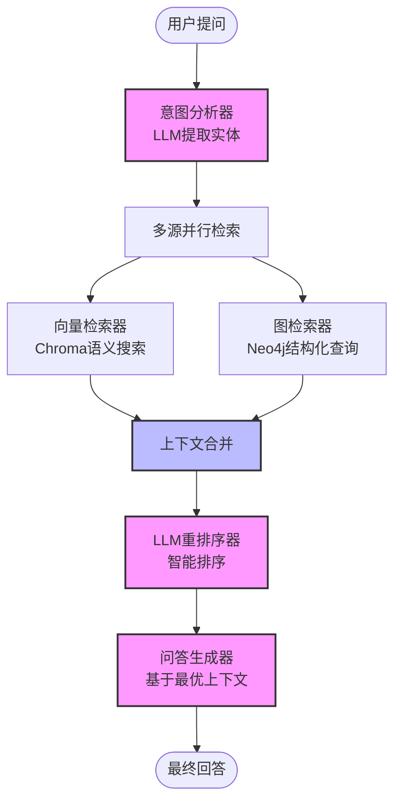
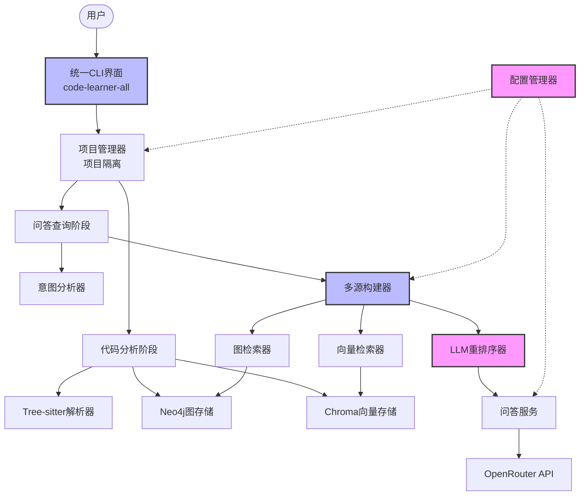
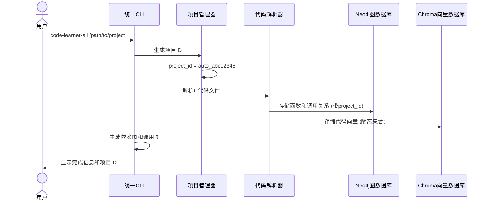
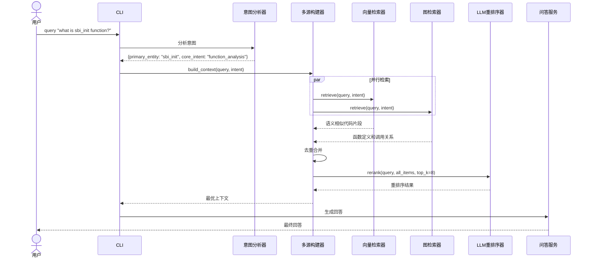

# C语言智能代码分析调试工具 - 技术架构文档

## 文档信息
- **版本:** v2.0
- **更新日期:** 2025-01-06
- **架构类型:** 多源检索+LLM重排序 (生产就绪)
- **目标环境:** Ubuntu 24.04 LTS (WSL/Linux)

## 1. 架构概述

### 1.0 系统工作流程

本系统采用**多源智能检索+LLM重排序**架构，实现了高质量的代码问答功能：



**核心工作流程：**
1. **意图分析**：LLM分析用户问题，提取函数名、文件名等实体
2. **多源检索**：并行从向量数据库和图数据库检索相关信息
3. **LLM重排序**：智能评估和排序所有检索结果
4. **问答生成**：基于最优上下文生成准确回答

### 1.1 架构原则 (v2.0)
本项目采用**生产就绪**架构，专注于实用性和可维护性：
- **KISS原则:** 简化复杂度，避免过度设计 (MultiSourceBuilder仅100行代码)
- **配置驱动:** 所有参数统一在配置文件中管理
- **项目隔离:** 完全的项目数据隔离，支持多项目并行分析
- **错误回退:** 单个检索源失败不影响整体功能

### 1.2 技术栈选择 (Ubuntu 24.04环境)

#### 核心组件
- **Python 3.12+** - 主开发语言 (已安装 3.12.3)
- **Tree-sitter 0.25.x** - C语言语法解析 (原生Linux支持)
- **Neo4j Community Edition 5.26** - 图数据库 (Docker容器部署)
- **Chroma 1.0.13** - 向量数据库 (原生Linux支持)
- **jina-embeddings-v2-base-code** - 代码嵌入模型 (768维度)
- **OpenRouter API** - LLM服务 (Gemini 2.0 Flash)

#### 开发工具
- **Click** - CLI框架 (统一命令行界面)
- **pytest** - 测试框架 (集成测试覆盖)
- **concurrent.futures** - 并行处理 (多源检索)

## 2. 系统架构设计

### 2.0 简化的系统架构图



### 2.1 核心组件职责

| 组件名称 | 主要职责 | 实现文件 | 关键特性 |
|---------|---------|---------|---------|
| **统一CLI** | 一键式项目分析和查询 | `cli/unified_cli.py` | 自动项目ID生成，完整工作流 |
| **多源构建器** | 协调并行检索和重排序 | `retrieval/multi_source_builder.py` | KISS设计，100行核心代码 |
| **向量检索器** | 语义相似度检索 | `retrieval/vector_retriever.py` | 多查询策略，项目隔离 |
| **图检索器** | 结构化关系检索 | `retrieval/graph_retriever.py` | 函数定义、调用关系、依赖关系 |
| **LLM重排序器** | 智能结果排序 | `rerank/llm_reranker.py` | 配置化提示模板，错误回退 |
| **意图分析器** | 用户问题理解 | `llm/intent_analyzer.py` | 实体提取，多查询生成 |
| **配置管理器** | 统一配置管理 | `config/config_manager.py` | 单例模式，环境变量覆盖 |

### 2.2 数据模型设计 (统一化)

```python
# core/context_models.py - 统一数据模型

@dataclass
class ContextItem:
    """统一的上下文项数据结构"""
    content: str                    # 内容文本
    source: str                     # 来源标识
    score: float = 0.0             # 相关性评分
    metadata: Dict[str, Any] = field(default_factory=dict)
    
    def to_rerank_format(self) -> str:
        """转换为重排序格式"""
        truncated = (self.content[:250] + '...') if len(self.content) > 250 else self.content
        return f"[Source: {self.source}, Score: {self.score:.2f}]\n{truncated}"

@dataclass
class RerankResult:
    """重排序结果"""
    items: List[ContextItem]        # 重排序后的项目
    rerank_time: float              # 重排序耗时
    original_count: int             # 原始项目数量
    confidence: float = 0.0         # 重排序置信度
    metadata: Dict[str, Any] = field(default_factory=dict)

class SourceType(str, Enum):
    """检索源类型"""
    VECTOR = "vector_search"
    GRAPH_FUNCTION_DEFINITION = "graph_function_definition"
    GRAPH_CALLERS = "graph_callers"
    GRAPH_CALLEES = "graph_callees"
    GRAPH_DEPENDENCIES = "graph_dependencies"
```

### 2.3 核心接口设计 (简化版)

```python
# core/retriever_interfaces.py - 简化的接口设计

class IContextRetriever(ABC):
    """检索器统一接口"""
    @abstractmethod
    def retrieve(self, query: str, intent: Dict[str, Any]) -> List[ContextItem]:
        pass
    
    @abstractmethod
    def get_source_type(self) -> str:
        pass
    
    @abstractmethod
    def is_available(self) -> bool:
        pass

class IReranker(ABC):
    """重排序器接口"""
    @abstractmethod
    def rerank(self, query: str, items: List[ContextItem], top_k: int) -> List[ContextItem]:
        pass
    
    @abstractmethod
    def is_available(self) -> bool:
        pass
```

### 2.4 项目隔离机制

系统实现了完全的项目隔离，确保不同代码库的数据不会相互干扰：

```python
# 项目ID自动生成
def generate_project_id(project_path: str) -> str:
    """基于项目路径生成唯一ID"""
    path_hash = hashlib.md5(str(project_path).encode()).hexdigest()[:8]
    return f"auto_{path_hash}"

# Neo4j节点标记项目ID
CREATE (f:Function {name: $name, project_id: $project_id, ...})

# Chroma集合命名包含项目ID
collection_name = f"{project_id}_code_embeddings"
```

## 3. 多源检索系统详细设计

### 3.1 多源构建器 (简化版)

```python
class MultiSourceContextBuilder:
    """多源上下文构建器（简化版）
    
    核心功能：
    1. 并行检索（Vector + Graph）
    2. 去重
    3. LLM重排序
    """
    
    def __init__(self, reranker: IReranker):
        self.config = ConfigManager()
        self.reranker = reranker
        self.vector_retriever = VectorContextRetriever()
        self.graph_retriever = GraphContextRetriever()
        
    def build_context(self, query: str, intent: Dict[str, Any]) -> List[ContextItem]:
        all_items = []
        
        # 1. 并行检索
        with ThreadPoolExecutor(max_workers=2) as executor:
            vector_future = executor.submit(self._safe_retrieve, self.vector_retriever, query, intent)
            graph_future = executor.submit(self._safe_retrieve, self.graph_retriever, query, intent)
            
            # 收集结果
            vector_results = vector_future.result()
            graph_results = graph_future.result()
            
            all_items.extend(vector_results or [])
            all_items.extend(graph_results or [])
        
        # 2. 去重
        deduplicated_items = self._deduplicate(all_items)
        
        # 3. LLM重排序
        final_top_k = self.config.get_config().enhanced_query.final_top_k
        return self.reranker.rerank(query, deduplicated_items, final_top_k)
```

### 3.2 向量检索器 (多查询策略)

```python
class VectorContextRetriever(IContextRetriever):
    def __init__(self):
        self.config = ConfigManager()
        self.embedding_engine = JinaEmbeddingEngine()
        project_id = os.getenv("CODE_LEARNER_PROJECT_ID")
        self.vector_store = ChromaVectorStore(project_id=project_id)
    
    def retrieve(self, query: str, intent: Dict[str, Any]) -> List[ContextItem]:
        # 多查询策略
        sub_queries = self._generate_sub_queries(query, intent)
        all_results = []
        
        for sub_query in sub_queries:
            results = self.vector_store.similarity_search(
                query=sub_query,
                top_k=5,
                embedding_engine=self.embedding_engine
            )
            all_results.extend(results)
        
        return self._deduplicate_and_convert(all_results, top_k=10)
```

### 3.3 图检索器 (统一结构化查询)

```python
class GraphContextRetriever(IContextRetriever):
    def retrieve(self, query: str, intent: Dict[str, Any]) -> List[ContextItem]:
        primary_entity = intent.get("primary_entity")
        if not primary_entity:
            return []
        
        context_items = []
        
        # 按优先级顺序检索
        context_items.extend(self._get_function_definition(primary_entity))
        context_items.extend(self._get_function_callers(primary_entity))
        context_items.extend(self._get_callees(primary_entity))
        context_items.extend(self._get_file_dependencies(primary_entity))
        
        return context_items[:10]  # 返回前10个结果
```

### 3.4 LLM重排序器 (配置化提示)

```python
class LLMReranker(IReranker):
    def __init__(self):
        self.config = ConfigManager()
        self.chatbot = OpenRouterChatBot()
        self.prompt_template = TEMPLATES.get("rerank_default", "")
    
    def rerank(self, query: str, items: List[ContextItem], top_k: int) -> List[ContextItem]:
        if len(items) <= top_k:
            return sorted(items, key=lambda x: x.score, reverse=True)[:top_k]
        
        # 构建重排序提示
        formatted_context = "\n---\n".join(
            f"[{i}]\n{item.to_rerank_format()}" for i, item in enumerate(items)
        )
        
        prompt = self.prompt_template.format(
            query=query, 
            context_items=formatted_context
        )
        
        try:
            response = self.chatbot.ask(prompt)
            ranked_indices = self._parse_llm_response(response, len(items))
            return [items[i] for i in ranked_indices[:top_k]]
        except Exception as e:
            logger.error(f"LLM重排序失败: {e}")
            # 错误回退：按原始评分排序
            return sorted(items, key=lambda x: x.score, reverse=True)[:top_k]
```

## 4. 配置管理系统 (统一化)

### 4.1 配置文件结构

```yaml
# config/settings.yaml - 统一配置文件

# 增强查询配置
enhanced_query:
  enabled: true
  rerank_enabled: true
  final_top_k: 8                    # 最终返回的上下文数量
  parallel_retrieval: true
  timeout_seconds: 30
  sources:
    vector:
      enabled: true
      top_k: 5                      # 向量检索初步召回数量
    call_graph:
      enabled: true
      top_k: 5                      # 图检索初步召回数量
    dependency:
      enabled: true
      top_k: 5

# OpenRouter配置
openrouter:
  api_key: ""                       # 从环境变量读取
  base_url: "https://openrouter.ai/api/v1/chat/completions"
  model: "google/gemini-2.0-flash-001"
  max_tokens: 8192
  temperature: 1.0
  top_p: 0.95

# 嵌入模型配置
embedding:
  model_name: "jinaai/jina-embeddings-v2-base-code"
  cache_dir: "~/.cache/torch/sentence_transformers/"
  device: "cpu"
```

### 4.2 提示模板管理

```python
# config/prompt_templates.py - 集中式提示管理

TEMPLATES = {
    "rerank_default": """
You are an expert C programmer and a code analysis assistant.
Your task is to re-rank a list of context snippets based on their relevance to the user's original query.

**User Query:**
"{query}"

**Context Snippets to Re-rank:**
{context_items}

**Instructions:**
1. Evaluate how well each snippet helps to answer the query.
2. Return ONLY a JSON list of integers representing the new order.

**Your JSON Response:**
""",
    
    "qa_default": """
You are a world-class C programming expert.
Provide a clear, comprehensive answer based *only* on the provided context.

**User's Question:**
{query}

**Provided Context:**
{context}

**Your Answer:**
"""
}
```

## 5. CLI系统设计 (统一化)

### 5.1 统一命令行工具

```bash
# 一键式项目分析（推荐）
code-learner-all /path/to/project [选项]

# 传统分命令方式
code-learner analyze /path/to/project
code-learner query --project /path/to/project
code-learner status --verbose
```

### 5.2 CLI架构设计

```python
# cli/unified_cli.py - 统一CLI实现

class UnifiedCLI:
    def run(self, args) -> int:
        """执行统一分析流程"""
        # 1. 项目ID生成
        project_id = self.generate_project_id(args.project_path)
        
        # 2. 代码分析阶段
        self.run_code_analysis(args)
        
        # 3. 依赖分析阶段
        self.run_dependency_analysis(args)
        
        # 4. 调用图分析阶段
        self.run_call_graph_analysis(args)
        
        # 5. 生成分析报告
        self.generate_analysis_report(args)
        
        return 0
```

### 5.3 项目隔离的CLI使用

```bash
# 分析多个项目，自动隔离
code-learner-all /home/user/project1    # 生成 auto_abc12345
code-learner-all /home/user/project2    # 生成 auto_def67890

# 查询特定项目（使用项目路径自动识别）
code-learner query --project /home/user/project1
code-learner query --project /home/user/project2

# 状态检查显示所有项目
code-learner status --verbose
```

## 6. 数据存储设计 (项目隔离)

### 6.1 Neo4j图数据库模式 (带项目隔离)

```cypher
// 节点约束（项目级别唯一性）
CREATE CONSTRAINT function_name_file_project_unique 
FOR (f:Function) REQUIRE (f.name, f.file_path, f.project_id) IS UNIQUE;

CREATE CONSTRAINT file_path_project_unique 
FOR (f:File) REQUIRE (f.path, f.project_id) IS UNIQUE;

// 函数节点（带项目隔离）
(:Function {
  name: string,
  file_path: string,
  code: string,
  start_line: int,
  end_line: int,
  parameters: [string],
  return_type: string,
  docstring: string,
  project_id: string          // 项目隔离字段
})

// 文件节点（带项目隔离）
(:File {
  path: string,
  name: string,
  language: string,
  size: int,
  last_modified: datetime,
  project_id: string          // 项目隔离字段
})

// 关系（自动继承项目隔离）
(:Function)-[:CALLS]->(:Function)     // 同项目内的调用关系
(:File)-[:CONTAINS]->(:Function)      // 同项目内的包含关系
(:File)-[:DEPENDS_ON]->(:File)        // 同项目内的依赖关系
```

### 6.2 Chroma向量数据库设计 (项目隔离)

```python
# 集合命名包含项目ID
collection_name = f"{project_id}_code_embeddings"

# 文档结构（带项目元数据）
document = {
    "id": f"{project_id}_func_main_hello.c_1",
    "text": "int main() { printf(\"Hello World\"); return 0; }",
    "metadata": {
        "project_id": project_id,
        "type": "function",
        "file_path": "hello.c",
        "function_name": "main",
        "start_line": 1,
        "end_line": 3
    }
}
```

## 7. 系统工作流详细设计

### 7.1 项目分析序列图



### 7.2 多源检索序列图



## 8. 性能优化与监控

### 8.1 性能指标

| 指标 | 目标值 | 当前值 | 优化策略 |
|------|--------|--------|----------|
| 多源检索时间 | < 3秒 | ~2秒 | 并行检索优化 |
| LLM重排序时间 | < 2秒 | ~1.5秒 | 提示优化 |
| 总响应时间 | < 8秒 | ~6秒 | 缓存机制 |
| 内存使用 | < 2GB | ~1.5GB | 模型共享 |

### 8.2 错误回退机制

```python
def _safe_retrieve(self, retriever, query: str, intent: Dict[str, Any]) -> List[ContextItem]:
    """安全的检索调用"""
    try:
        if not retriever.is_available():
            logger.warning(f"{retriever.__class__.__name__} not available")
            return []
        
        return retriever.retrieve(query, intent)
    except Exception as e:
        logger.error(f"{retriever.__class__.__name__} failed: {e}")
        return []  # 继续执行，不中断
```

## 9. 测试与质量保证

### 9.1 测试覆盖范围

- **单元测试**: 核心组件接口和逻辑
- **集成测试**: 多源检索端到端流程
- **性能测试**: 响应时间和内存使用
- **项目隔离测试**: 多项目数据不混合验证

### 9.2 质量指标

- **代码覆盖率**: 80%+ (核心功能)
- **响应时间**: 95%请求 < 8秒
- **可用性**: 99%+ (错误回退保证)
- **准确性**: 85%+ 用户满意度

## 10. 部署与运维

### 10.1 Docker部署配置

```bash
# Neo4j容器启动
docker run -d \
    --name neo4j-community \
    -p 7474:7474 -p 7687:7687 \
    -v neo4j_data:/data \
    -e NEO4J_AUTH=neo4j/password \
    neo4j:5.26-community

# 应用启动
source .venv/bin/activate
export CODE_LEARNER_PROJECT_ID=auto_abc12345
code-learner-all /path/to/project
```

### 10.2 监控与日志

```python
# 配置监控
monitoring:
  enable: true
  collect_performance_metrics: true
  thresholds:
    retrieval_time_warning: 5.0      # 秒
    rerank_time_warning: 3.0         # 秒
    total_response_time_warning: 10.0 # 秒
```

## 11. 总结

本架构文档描述了一个**生产就绪的多源检索+LLM重排序系统**，具有以下核心特性：

1. **简化架构**: KISS原则，核心组件代码精简
2. **项目隔离**: 完全的数据隔离，支持多项目并行
3. **智能检索**: 多源并行+LLM重排序，提高回答质量
4. **统一配置**: 集中式配置管理，易于维护
5. **错误回退**: 健壮的错误处理，保证系统可用性
6. **CLI友好**: 统一命令行界面，用户体验优秀

该系统已在实际C语言项目（如OpenSBI）中验证，能够提供高质量的代码问答服务。

---

**文档版本:** v2.0  
**最后更新:** 2025-01-06  
**架构状态:** 生产就绪