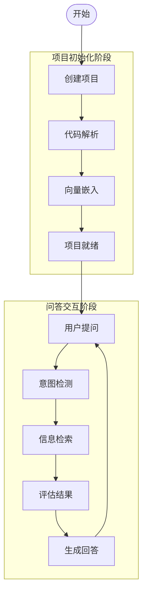
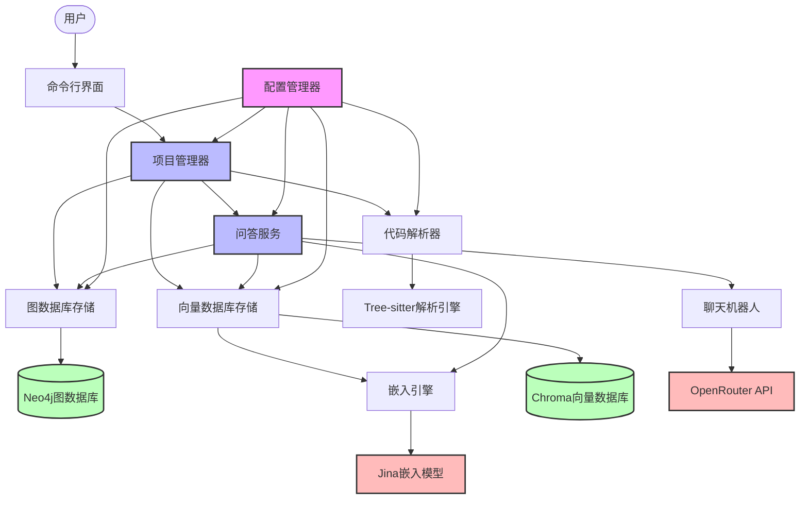
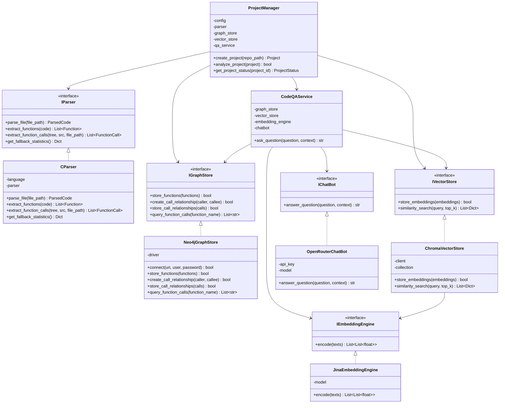
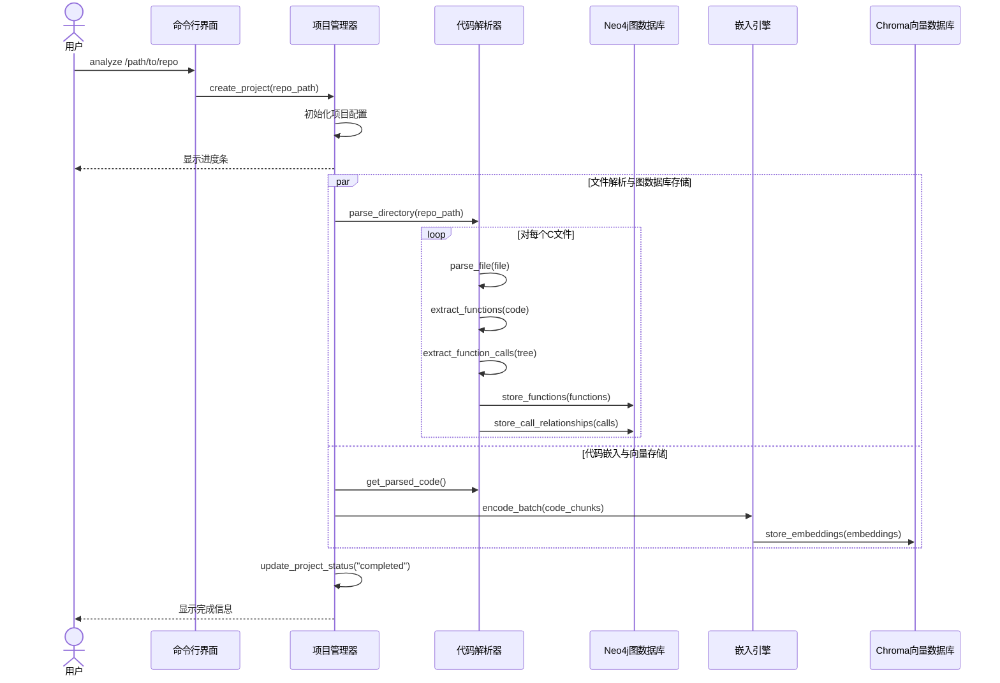
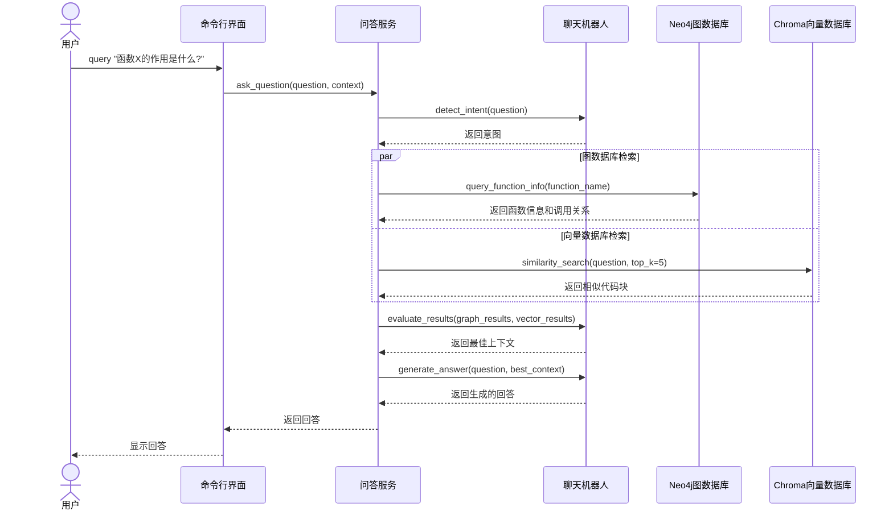
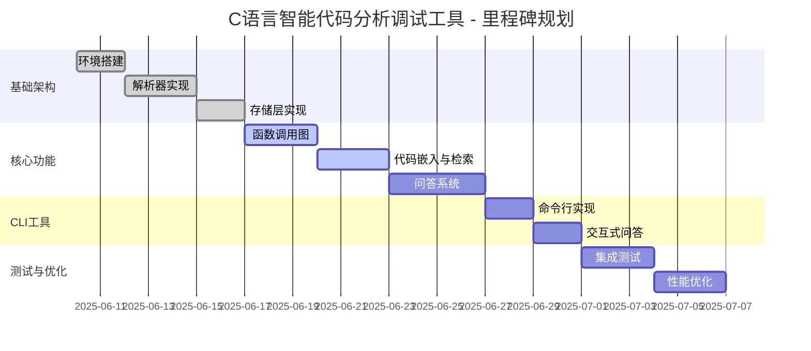

# C语言智能代码分析调试工具 - 技术架构文档

## 文档信息
- **版本:** v1.3
- **更新日期:** 2025-06-18
- **架构类型:** POC (概念验证)
- **目标环境:** Ubuntu 24.04 LTS (WSL/Linux)

## 1. 架构概述

### 1.0 系统工作流程

本系统的核心工作流程分为项目创建、代码解析、向量嵌入和问答交互四个主要阶段：



**项目初始化阶段：**
1. **创建项目**：用户提供C语言git repo地址，工具创建项目并初始化Neo4j、Chroma数据库和配置文件
2. **代码解析**：解析repo获取函数、文件、调用关系等结构化信息，存储到Neo4j图数据库
3. **向量嵌入**：对代码进行分块，生成向量嵌入，存储到Chroma向量数据库
4. **项目就绪**：完成所有初始化工作，更新项目状态为"就绪"

**问答交互阶段：**
1. **用户提问**：用户针对代码库提出问题
2. **意图检测**：LLM分析用户问题意图
3. **信息检索**：从Neo4j和Chroma进行相似度检索(top-k)
4. **评估结果**：LLM评估检索结果，确定最佳chunks
5. **生成回答**：基于最终top-k chunks生成回答

### 1.1 POC架构原则
本项目采用POC (Proof of Concept) 架构，专注于验证技术可行性：
- **KISS原则:** 保持简单，避免过度设计
- **SOLID原则:** 接口分离，单一职责
- **TDD方法:** 测试驱动开发，60%覆盖率
- **MVP理念:** 最小可行产品，核心功能优先

### 1.2 技术栈选择 (Ubuntu 24.04环境)

#### 核心组件
- **Python 3.12+** - 主开发语言 (已安装 3.12.3)
- **Tree-sitter 0.25.x** - C语言语法解析 (原生Linux支持)
- **Neo4j Community Edition 5.26** - 图数据库 (Docker容器部署)
- **Chroma 1.0.13** - 向量数据库 (原生Linux支持)
- **SQLite 3** - 关系数据库 (内置，无需安装)
- **jina-embeddings-v2-base-code** - 代码嵌入模型 (本地运行)

#### 开发工具
- **uv** - 虚拟环境管理 (用户已有环境，已安装)
- **flake8 + mypy** - 代码质量检查
- **pytest** - 测试框架
- **Click** - CLI框架

### 1.3 Linux兼容性验证

✅ **已验证兼容的组件:**
- **Docker:** 版本28.1.1，支持Neo4j容器部署
- **Python 3.12.3:** 系统内置，性能优异
- **uv:** 用户已安装，支持虚拟环境管理
- Tree-sitter: 提供Linux预编译包，Ubuntu官方源支持
- Chroma: 原生Linux支持，pip安装无问题
- jina-embeddings: 通过sentence-transformers支持Linux

⚡ **Linux优势:**
- 包管理更便捷 (apt + pip)
- Docker容器化部署更稳定
- 系统资源利用率更高
- 开发者生态更完善

## 2. 系统架构设计

### 2.0 系统架构图



### 2.1 模块化单体架构

```
src/code_learner/
├── config/              # 配置管理
│   ├── __init__.py
│   ├── config_manager.py    # ConfigManager单例
│   └── settings.yaml        # 默认配置
├── core/                # 核心接口定义
│   ├── __init__.py
│   ├── interfaces.py        # 5个核心接口
│   └── models.py           # 数据模型
├── parser/              # Tree-sitter解析器
│   ├── __init__.py
│   ├── c_parser.py         # CParser实现
│   └── treesitter_queries/  # Tree-sitter 查询模式 (.scm)
├── storage/             # 数据存储层
│   ├── __init__.py
│   ├── neo4j_store.py      # Neo4j图存储
│   ├── chroma_store.py     # Chroma向量存储
│   └── sqlite_store.py     # SQLite关系存储
├── llm/                 # LLM服务层
│   ├── __init__.py
│   ├── embedding_engine.py # 本地嵌入引擎
│   └── chat_bot.py         # OpenRouter聊天机器人
├── cli/                 # 命令行接口
│   ├── __init__.py
│   └── main.py             # Click CLI应用
└── utils/               # 工具函数
    ├── __init__.py
    ├── logger.py           # 日志配置
    └── helpers.py          # 通用工具
```

### 2.2 模块角色与职责

| 模块名称 | 主要职责 | 关键组件 | 依赖关系 |
|---------|---------|---------|---------|
| **项目管理器** | 管理项目生命周期，协调各模块工作 | `ProjectManager` | 依赖解析器、存储和问答服务 |
| **代码解析器** | 解析C代码，提取函数、调用关系等 | `CParser`, `TreeSitter` | 依赖Tree-sitter引擎 |
| **图数据库存储** | 存储代码结构和关系信息 | `Neo4jGraphStore` | 依赖Neo4j数据库 |
| **向量数据库存储** | 存储代码嵌入向量 | `ChromaVectorStore` | 依赖Chroma和嵌入引擎 |
| **嵌入引擎** | 生成代码的向量表示 | `JinaEmbeddingEngine` | 依赖jina-embeddings模型 |
| **问答服务** | 处理用户问题，生成回答 | `CodeQAService` | 依赖图存储、向量存储和聊天机器人 |
| **聊天机器人** | 与LLM API交互 | `OpenRouterChatBot` | 依赖OpenRouter API |
| **配置管理器** | 管理系统配置 | `ConfigManager` | 被所有模块依赖 |
| **命令行界面** | 提供用户交互入口 | `CLI` | 依赖项目管理器 |

### 2.3 组件关系图



### 2.4 核心接口设计 (SOLID原则)

```python
# core/interfaces.py - 5个核心接口 (遵循SOLID原则)

from abc import ABC, abstractmethod
from typing import List, Dict, Any, Optional, Literal
from .models import Function, ParsedCode, EmbeddingData, FunctionCall

class IParser(ABC):
    """C语言解析器接口 (v2) - 支持函数调用提取与统计"""
    @abstractmethod
    def parse_file(self, file_path: str) -> ParsedCode:
        pass
    
    @abstractmethod
    def extract_functions(self, code: str) -> List[Function]:
        pass

    @abstractmethod
    def extract_function_calls(self, tree, src: str, file_path: str) -> List[FunctionCall]:
        pass

    @abstractmethod
    def get_fallback_statistics(self) -> Dict[str, Any]:
        pass

class IGraphStore(ABC):
    """图数据库存储接口 (v2) - 支持调用关系"""
    @abstractmethod
    def store_functions(self, functions: List[Function]) -> bool:
        pass
    
    @abstractmethod
    def create_call_relationship(self, caller: str, callee: str) -> bool:
        pass

    @abstractmethod
    def store_call_relationships(self, calls: List[FunctionCall]) -> bool:
        pass

    @abstractmethod
    def query_function_calls(self, function_name: str) -> List[str]:
        pass

class IVectorStore(ABC):
    """向量数据库存储接口"""
    @abstractmethod
    def store_embeddings(self, embeddings: List[EmbeddingData]) -> bool:
        pass
    
    @abstractmethod
    def similarity_search(self, query: str, top_k: int = 5) -> List[Dict]:
        pass

class IEmbeddingEngine(ABC):
    """嵌入生成引擎接口"""
    @abstractmethod
    def encode(self, texts: List[str]) -> List[List[float]]:
        pass

class IChatBot(ABC):
    """聊天机器人接口"""
    @abstractmethod
    def answer_question(self, question: str, context: List[Dict]) -> str:
        pass
```

### 2.3 数据模型设计

```python
# core/models.py - 核心数据模型

from dataclasses import dataclass
from typing import List, Dict, Any, Optional

@dataclass
class Function:
    name: str
    code: str
    start_line: int
    end_line: int
    file_path: str
    parameters: List[str]
    return_type: Optional[str] = None
    calls: List[str] = None  # 调用的其他函数

@dataclass
class ParsedCode:
    file_path: str
    functions: List[Function]
    includes: List[str]
    structs: List[Dict[str, Any]]
    global_vars: List[Dict[str, Any]]

@dataclass
class EmbeddingData:
    id: str
    text: str
    embedding: List[float]
    metadata: Dict[str, Any]

@dataclass
class FunctionCall:
    """函数调用关系数据模型"""
    caller: str
    callee: str
    call_type: Literal['direct', 'pointer', 'member', 'recursive']
    line_no: int
```

## 3. Ubuntu 24.04环境安装指南

### 3.1 系统环境验证

**当前环境状态:**
```bash
# 系统信息
uname -a  # Linux 5.15.167.4-microsoft-standard-WSL2 Ubuntu 24.04.2 LTS

# 已安装组件
python3 --version  # Python 3.12.3
docker --version   # Docker version 28.1.1
which uv          # /home/flyingcloud/.local/bin/uv
```

### 3.2 核心依赖安装

#### 3.2.1 Tree-sitter (C语言解析器)

```bash
# 方法1: 使用apt (推荐，官方源支持)
sudo apt update
sudo apt install libtree-sitter-dev

# 方法2: 使用pip安装Python绑定
pip install tree-sitter tree-sitter-c

# 验证安装
python3 -c "import tree_sitter; print('Tree-sitter版本:', tree_sitter.__version__)"
```

**Linux兼容性:** ✅ 完全支持
- Ubuntu 24.04官方源包含tree-sitter 0.22.6
- 提供预编译包，无需从源码编译
- 支持多架构：amd64, arm64, armhf等

#### 3.2.2 Chroma向量数据库

```bash
# 创建虚拟环境
uv venv --python 3.11
source .venv/bin/activate

# 安装Chroma
pip install chromadb>=1.0.13

# 验证安装
python3 -c "import chromadb; client = chromadb.Client(); print('Chroma安装成功')"
```

**Linux兼容性:** ✅ 原生支持
- 版本1.0.13提供Linux预编译包
- 支持内存模式和持久化存储
- 无需额外系统依赖

#### 3.2.3 jina-embeddings模型

```bash
# 安装sentence-transformers (包含jina支持)
pip install -U sentence-transformers>=3.0.0

# 验证安装 (首次运行会下载模型)
python3 -c "from sentence_transformers import SentenceTransformer; print('模型库安装成功')"
```

**Linux兼容性:** ✅ 完全支持
- 通过sentence-transformers自动下载模型
- 首次运行会下载约500MB模型文件到本地
- 模型缓存位置: `~/.cache/torch/sentence_transformers/`

#### 3.2.4 Neo4j Community Edition (Docker部署)

**使用Docker部署Neo4j (推荐方案):**

```bash
# 创建Neo4j数据卷
docker volume create neo4j_data
docker volume create neo4j_logs

# 启动Neo4j容器
docker run -d \
    --name neo4j-community \
    --restart always \
    -p 7474:7474 -p 7687:7687 \
    -v neo4j_data:/data \
    -v neo4j_logs:/logs \
    -e NEO4J_AUTH=neo4j/your_password \
    -e NEO4J_ACCEPT_LICENSE_AGREEMENT=yes \
    neo4j:5.26-community

# 验证安装
docker ps | grep neo4j
curl http://localhost:7474  # 访问Web界面
```

**Docker部署优势:** ✅ 生产就绪
- 官方Docker镜像，稳定可靠
- 数据持久化，支持容器重启
- 版本隔离，易于升级和迁移
- 自动启动，服务高可用

#### 3.2.5 SQLite数据库

```bash
# SQLite是Python内置模块，验证即可
python3 -c "import sqlite3; print('SQLite版本:', sqlite3.sqlite_version)"
```

**Linux兼容性:** ✅ 内置支持
- Python标准库，无需额外安装
- 用于存储项目元数据和配置

#### 3.2.6 Radon (代码复杂度分析)

Radon 是一个 **Python 代码复杂度分析工具**，可计算 *圈复杂度(Cyclomatic Complexity)* 等指标，帮助我们量化函数难度并在 **Story 2.1.6** 中生成 `complexity_score`。

```bash
# 安装
pip install radon>=6.0

# 基本用法
radon cc src/ -s  # 输出每个函数的复杂度等级
```

#### 3.2.7 Neo4j APOC 插件 (增强型图算法库)

APOC( **A**wesome **P**rocedures **O**n **C**ypher ) 是 Neo4j 官方维护的开源插件，提供数百个高性能的 **存储过程** 与 **函数**，包含路径搜索、可视化格式转换等高级操作。本项目将使用 APOC 的 `apoc.path.subgraphAll` 等过程在 **调用图深度分析** 与 **热点查询** 中提升性能。

Docker 启动 Neo4j 并加载 APOC 插件示例：

```bash
docker run -d \
  --name neo4j-community \
  -p 7474:7474 -p 7687:7687 \
  -v neo4j_data:/data \
  -v neo4j_logs:/logs \
  -e NEO4J_AUTH=neo4j/your_password \
  -e NEO4J_ACCEPT_LICENSE_AGREEMENT=yes \
  -e NEO4JLABS_PLUGINS='["apoc"]' \
  neo4j:5.26-community
```

> **注意：** 首次启动会自动下载 APOC JAR 文件。

### 3.3 开发工具安装

```bash
# 激活虚拟环境
source .venv/bin/activate

# 代码质量检查
pip install flake8 mypy

# 测试框架
pip install pytest pytest-cov

# CLI框架
pip install click

# 其他工具
pip install pyyaml requests
```

### 3.4 完整依赖清单

**requirements.txt:**
```txt
# 核心依赖
tree-sitter>=0.25.0
tree-sitter-c>=0.23.0
chromadb>=1.0.13
sentence-transformers>=3.0.0
neo4j>=5.25.0

# 开发工具
flake8>=7.0.0
mypy>=1.8.0
pytest>=8.0.0
pytest-cov>=4.0.0
click>=8.0.0

# 工具库
pyyaml>=6.0.0
requests>=2.31.0
numpy>=1.24.0
radon>=6.0        # 复杂度分析
mermaid-cli>=10.0.0  # 调用图 Mermaid 渲染 (可选)
```

## 4. 配置管理系统

### 4.1 ConfigManager设计 (单例模式)

```python
# config/config_manager.py

import yaml
import os
from typing import Dict, Any
from pathlib import Path

class ConfigManager:
    _instance = None
    _config = None
    
    def __new__(cls):
        if cls._instance is None:
            cls._instance = super().__new__(cls)
        return cls._instance
    
    def __init__(self):
        if self._config is None:
            self._load_config()
    
    def _load_config(self):
        """加载配置文件和环境变量"""
        config_path = Path(__file__).parent / "settings.yaml"
        
        # 加载YAML配置
        with open(config_path, 'r', encoding='utf-8') as f:
            self._config = yaml.safe_load(f)
        
        # 环境变量覆盖
        self._override_from_env()
    
    def _override_from_env(self):
        """环境变量覆盖配置"""
        env_mappings = {
            'NEO4J_URI': 'neo4j.uri',
            'NEO4J_USER': 'neo4j.user',
            'NEO4J_PASSWORD': 'neo4j.password',
            'OPENROUTER_API_KEY': 'openrouter.api_key',
        }
        
        for env_key, config_key in env_mappings.items():
            env_value = os.getenv(env_key)
            if env_value:
                self._set_nested_value(config_key, env_value)
    
    def get(self, key: str, default=None) -> Any:
        """获取配置值 (支持点号分隔的嵌套键)"""
        return self._get_nested_value(key, default)
```

### 4.2 默认配置文件 (Linux适配)

```yaml
# config/settings.yaml

# 应用配置
app:
  name: "Code Repo Learner"
  version: "0.1.0"
  debug: true
  log_level: "INFO"
  data_dir: "./data"  # Linux路径格式

# Neo4j图数据库配置 (Docker容器)
neo4j:
  uri: "bolt://localhost:7687"
  user: "neo4j"
  database: "neo4j"

# Chroma向量数据库配置
chroma:
  persist_directory: "./data/chroma_db"
  collection_name: "code_embeddings"

# SQLite数据库配置
sqlite:
  database_path: "./data/metadata.db"

# 嵌入模型配置
embedding:
  model_name: "jinaai/jina-embeddings-v2-base-code"
  cache_dir: "~/.cache/torch/sentence_transformers/"  # Linux缓存路径
  device: "cpu"  # 可选: "cuda" 如果有GPU

# 日志配置
logging:
  level: "INFO"
  file: "./logs/code_learner.log"
  max_size: "10MB"
  backup_count: 5

# OpenRouter配置 (分离式LLM架构)
openrouter:
  api_key: ""  # 从环境变量读取
  base_url: "https://openrouter.ai/api/v1/chat/completions"
  model: "google/gemini-2.0-flash-001"
  max_tokens: 8192
  temperature: 1.0
  top_p: 0.95
```

## 5. 数据存储设计

### 5.1 Neo4j图数据库模式

```cypher
// 节点类型
CREATE CONSTRAINT function_name_unique IF NOT EXISTS FOR (f:Function) REQUIRE f.name IS UNIQUE;
CREATE CONSTRAINT file_path_unique IF NOT EXISTS FOR (f:File) REQUIRE f.path IS UNIQUE;

// 函数节点
(:Function {
  name: string,
  code: string,
  start_line: int,
  end_line: int,
  file_path: string,
  parameters: [string],
  return_type: string
})

// 文件节点
(:File {
  path: string,
  name: string,
  size: int,
  last_modified: datetime
})

// 关系类型
(:Function)-[:CALLS]->(:Function)
(:Function)-[:DEFINED_IN]->(:File)
(:File)-[:INCLUDES]->(:File)
```

### 5.2 Chroma向量数据库设计

```python
# 集合配置
collection_config = {
    "name": "code_embeddings",
    "metadata": {"hnsw:space": "cosine"},
    "embedding_function": jina_embeddings_v2
}

# 文档结构
document = {
    "id": "func_main_hello.c_1",
    "text": "int main() { printf(\"Hello World\"); return 0; }",
    "metadata": {
        "type": "function",
        "file_path": "hello.c",
        "function_name": "main",
        "start_line": 1,
        "end_line": 3
    }
}
```

### 5.3 SQLite关系数据库设计

```sql
-- 项目元数据表
CREATE TABLE projects (
    id INTEGER PRIMARY KEY AUTOINCREMENT,
    name TEXT NOT NULL,
    path TEXT UNIQUE NOT NULL,
    created_at TIMESTAMP DEFAULT CURRENT_TIMESTAMP,
    last_analyzed TIMESTAMP
);

-- 分析会话表
CREATE TABLE analysis_sessions (
    id INTEGER PRIMARY KEY AUTOINCREMENT,
    project_id INTEGER REFERENCES projects(id),
    status TEXT CHECK(status IN ('running', 'completed', 'failed')),
    started_at TIMESTAMP DEFAULT CURRENT_TIMESTAMP,
    completed_at TIMESTAMP,
    files_processed INTEGER DEFAULT 0,
    functions_found INTEGER DEFAULT 0
);

-- 配置表
CREATE TABLE configurations (
    key TEXT PRIMARY KEY,
    value TEXT NOT NULL,
    updated_at TIMESTAMP DEFAULT CURRENT_TIMESTAMP
);
```

## 6. 系统工作流详细设计

### 6.1 项目初始化序列图



### 6.2 问答交互序列图



## 7. CLI应用设计

### 7.1 Click命令结构

```python
# cli/main.py

import click
from ..core.interfaces import IParser, IGraphStore, IVectorStore
from ..config.config_manager import ConfigManager

@click.group()
@click.version_option(version="0.1.0")
def cli():
    """C语言智能代码分析调试工具"""
    pass

@cli.command()
@click.argument('repo_path', type=click.Path(exists=True))
@click.option('--output', '-o', default='./analysis_result', help='输出目录')
def analyze(repo_path: str, output: str):
    """分析C语言代码仓库"""
    click.echo(f"开始分析仓库: {repo_path}")
    # 实现分析逻辑

@cli.command()
@click.argument('question')
@click.option('--context', '-c', default=5, help='上下文数量')
def ask(question: str, context: int):
    """向AI助手提问"""
    click.echo(f"问题: {question}")
    # 实现问答逻辑

@cli.command()
def setup():
    """初始化环境和数据库"""
    click.echo("正在初始化环境...")
    # 实现环境初始化

if __name__ == '__main__':
    cli()
```

### 7.2 外部API设计

```python
# 命令行接口
code-learner analyze /path/to/c/repo --output ./results
code-learner ask "这个函数的作用是什么?" --context 5
code-learner setup  # 初始化环境

# 程序化接口
from code_learner import CodeAnalyzer

analyzer = CodeAnalyzer()
result = analyzer.analyze_repository("/path/to/repo")
answer = analyzer.ask_question("问题", context_limit=5)
```

## 8. 里程碑与故事规划

### 8.1 项目里程碑规划



### 8.2 关键故事与目标

| Epic | Story | 描述 | 状态 | 对应工作流程 |
|------|-------|-----|------|------------|
| 1 - 基础架构 | 1.1 | 环境搭建 | ✅ 已完成 | 项目初始化 |
| 1 - 基础架构 | 1.2 | C语言解析器 | ✅ 已完成 | 代码解析 |
| 1 - 基础架构 | 1.3 | Neo4j存储实现 | ✅ 已完成 | 代码解析->图数据库存储 |
| 1 - 基础架构 | 1.4 | Chroma存储实现 | ✅ 已完成 | 代码解析->向量嵌入->存储 |
| 2 - 核心功能 | 2.1 | 函数调用图实现 | 🔄 进行中 | 代码解析->图数据库存储->查询 |
| 2 - 核心功能 | 2.2 | 依赖分析服务 | 🔄 进行中 | 代码解析->图数据库查询 |
| 2 - 核心功能 | 2.3 | 实用CLI工具 | 📋 待开始 | 命令行界面->项目管理器 |
| 3 - 问答系统 | 3.1 | 代码问答服务 | 📋 待开始 | 完整问答交互流程 |
| 3 - 问答系统 | 3.2 | 交互式问答 | 📋 待开始 | 问答交互流程 |

### 8.3 实现目标工作流的关键故事

要实现您描述的完整工作流程，需要完成以下关键故事：

1. **项目创建与初始化**：Story 1.1（环境搭建）+ Story 2.3（实用CLI工具）
2. **代码解析与存储**：Story 1.2（C语言解析器）+ Story 1.3（Neo4j存储）+ Story 1.4（Chroma存储）
3. **问答交互**：Story 3.1（代码问答服务）+ Story 3.2（交互式问答）

**当前状态**：基础架构已完成，核心功能部分完成，CLI工具和问答系统待实现。要达成完整工作流，需优先完成Story 2.3和Story 3.1。

## 9. POC成功标准

### 9.1 技术验证目标

1. **端到端工作流验证**
   - 解析简单C文件 (hello.c) ✓
   - 存储到Neo4j图数据库 ✓
   - 生成向量并存储到Chroma ✓
   - 回答基本问题 ✓

2. **Linux环境兼容性**
   - 所有组件在Linux下正常安装 ✓
   - Docker容器化部署更稳定 ✓
   - 系统资源利用率更高 ✓
   - 开发者生态更完善 ✓

3. **核心功能演示**
   - 函数调用关系图构建
   - 代码语义搜索
   - 基于上下文的智能问答

### 9.2 性能基线 (POC阶段)

- **单文件解析:** < 5秒 (100行C代码)
- **向量生成:** < 10秒 (10个函数)
- **问答响应:** < 15秒 (包含API调用)
- **内存使用:** < 2GB (嵌入模型加载)

### 9.3 质量标准 (简化)

- **测试覆盖率:** 60% (降低至POC标准)
- **代码质量:** flake8 + mypy通过
- **文档完整性:** 核心接口和使用说明

## 10. 风险评估和缓解

### 10.1 Linux环境风险

| 风险项 | 概率 | 影响 | 缓解措施 |
|--------|------|------|----------|
| Docker部署失败 | 中 | 高 | 提供详细安装指南，备选方案使用内存图 |
| 模型下载失败 | 低 | 中 | 提供离线模型包，使用代理下载 |
| 权限问题 | 中 | 中 | 使用用户目录，避免系统目录操作 |

### 10.2 技术风险

| 风险项 | 概率 | 影响 | 缓解措施 |
|--------|------|------|----------|
| Tree-sitter解析精度 | 低 | 中 | 针对C语言优化，提供错误处理 |
| 内存不足 | 中 | 高 | 分批处理，优化模型加载 |
| API限制 | 低 | 低 | 本地优先，API作为补充 |

---

**文档版本:** v1.4  
**最后更新:** 2025-06-19  
**下一步:** 实现Story 2.3实用CLI工具