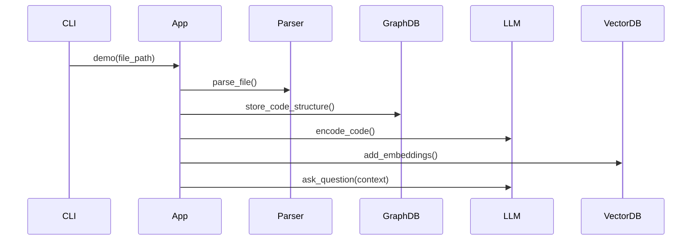

# C语言智能代码分析调试工具 - 会话工作台

## 当前会话状态

**会话目标：** Story 1.2 Tree-sitter C语言解析器实现完成  
**开始时间：** 2025-06-23  
**当前阶段：** Epic 1 核心技术验证阶段 - Story 1.2已完成  

## 详细设计成果总结

### ✅ 已完成的设计工作

#### 1. 架构文档全面细化 (01_architecture.md)
- **包结构设计：** 完整的7层模块结构（config/, core/, parser/, storage/, llm/, cli/, utils/）
- **配置系统设计：** ConfigManager单例模式，支持YAML配置和环境变量
- **接口系统设计：** 5个核心接口（IParser, IGraphStore, IVectorStore, IEmbeddingEngine, IChatBot）
- **数据模型设计：** 完整的数据类定义（Function, ParsedCode, EmbeddingData等）
- **类实现设计：** 每个核心类的详细方法定义和职责划分

#### 2. 工作计划详细化 (02_work_plan_progress.md)
- **Story 1.1细化：** 基础环境搭建包含配置系统、日志工具、异常处理
- **Story 1.2细化：** Tree-sitter解析器的完整实现方案，包含AST特征提取
- **TDD测试计划：** 每个Story的详细测试场景和100%通过标准
- **验收标准细化：** 从简单验证扩展到详细的功能验收

#### 3. 最佳实践记录 (03_project_bkm.md)
- **设计模式记录：** 单例模式、接口分离、优雅降级等模式应用
- **开发工作流：** Story实施流程、TDD红绿重构循环
- **技术决策记录：** 每个技术选择的详细理由和实施要点
- **Ubuntu环境适配：** TDR-001技术决策，所有组件Linux兼容性验证
- **常见问题解决方案：** Ubuntu环境、依赖管理、API限制等问题

#### 4. Ubuntu环境适配完成 (2025-06-18 更新)
- **架构文档更新 (v1.3)：** 完整的Ubuntu安装指南和兼容性验证
- **工作计划更新：** Story 1.1增加详细的Ubuntu依赖安装步骤
- **技术栈验证：** 所有核心组件Linux兼容性确认
  - ✅ Tree-sitter: apt系统包 + pip Python绑定
  - ✅ Chroma: 原生Linux支持
  - ✅ jina-embeddings: sentence-transformers完美支持
  - ✅ Neo4j: Community Edition Docker容器，稳定部署
  - ✅ SQLite: Python内置支持

### 📋 设计核心特点

#### SOLID原则应用
- **S - 单一职责：** 每个类和模块专注单一功能
- **O - 开闭原则：** 通过接口设计支持扩展
- **L - 里氏替换：** 接口实现可互相替换
- **I - 接口隔离：** 小而专注的接口设计
- **D - 依赖倒置：** 依赖抽象接口而非具体实现

#### POC + KISS原则平衡
- **详细设计但简化实现：** 接口设计完整，实现保持简单
- **100%测试但合理范围：** 核心功能100%覆盖，边界测试延后
- **配置完善但默认简单：** 支持灵活配置，提供合理默认值

#### TDD 100%通过策略
- **真实API测试：** 使用真实的Neo4j、Chroma、OpenRouter API
- **分层测试：** 单元测试 + 集成测试 + 端到端测试
- **Fixture设计：** 可重用的测试数据和环境
- **参数化测试：** 覆盖多种输入情况

## 详细设计亮点

### 1. 配置系统设计
```python
# 完整的配置层次结构
@dataclass
class DatabaseConfig:
    uri: str = "bolt://localhost:7687"
    user: str = "neo4j"
    password: str = "password"
    database: str = "neo4j"

# 单例模式确保配置一致性
class ConfigManager:
    _instance = None
    def __new__(cls): ...
```

### 2. 接口设计体系
```python
# 清晰的职责分离
class IParser(ABC):         # 专注解析
class IGraphStore(ABC):     # 专注图存储
class IVectorStore(ABC):    # 专注向量存储
class IEmbeddingEngine(ABC): # 专注嵌入计算
class IChatBot(ABC):        # 专注对话
```

### 3. 数据流设计


### 4. 测试体系设计
- **单元测试：** 每个类的独立功能测试
- **集成测试：** 组件间协作测试
- **端到端测试：** 完整工作流验证
- **真实环境测试：** 使用真实API和数据库

## 下一步行动计划

### 🎯 立即行动项
1. **开始Story 1.1实施：** Ubuntu环境搭建 + 创建包结构和配置系统
2. **环境准备：** 激活uv虚拟环境 .venv，安装所有Ubuntu依赖
3. **基础测试框架：** 设置pytest和测试配置，包含Ubuntu环境验证测试

### 📅 Epic 1实施计划
- **Story 1.1：** Ubuntu环境搭建与配置系统 (0.5天)
- **Story 1.2：** Tree-sitter C语言解析器实现 (1天)
- **Story 1.3：** Neo4j图数据库存储 (1天)
- **Story 1.4：** 向量嵌入与OpenRouter问答 (1天)

### 🔧 实施策略
1. **严格TDD：** 每个功能先写测试，再写实现
2. **渐进集成：** 每个Story完成后立即集成测试
3. **真实验证：** 使用真实API和数据库测试
4. **快速迭代：** 保持功能简单，快速验证可行性

## 设计质量评估

### ✅ 设计完整性检查
- [x] **包结构设计**：完整的7层架构
- [x] **配置系统设计**：单例模式，环境变量支持
- [x] **接口定义**：5个核心接口，职责清晰
- [x] **数据模型**：完整的数据类定义
- [x] **错误处理**：优雅降级模式
- [x] **测试策略**：100%覆盖，真实API测试
- [x] **CLI设计**：完整的命令行接口

### 📊 设计权衡记录
- **复杂度控制：** 接口设计完整但实现简化
- **可测试性：** 通过接口设计提高可测试性
- **可维护性：** 清晰的职责分离和模块化
- **可扩展性：** 接口为未来扩展预留空间

## 会话交接信息

### 🔄 上下文传递
- **项目阶段：** POC详细设计已完成，准备开始实施
- **技术栈：** Tree-sitter + Neo4j + Chroma + OpenRouter + Python 3.11
- **开发环境：** Ubuntu 24.04 LTS + uv虚拟环境
- **质量标准：** TDD 100%通过，真实API测试

### 📝 关键决策记录
1. **使用单例ConfigManager**：确保配置一致性
2. **接口优先设计**：支持SOLID原则和可测试性
3. **真实API测试**：验证实际集成可行性
4. **POC+KISS平衡**：详细设计但简化实现

### 🎯 成功标准
- **技术验证：** 4个核心技术能协同工作
- **端到端流程：** 单文件解析到问答的完整流程
- **测试质量：** 100%核心功能测试通过
- **用户体验：** 简单易用的CLI演示

---

**下一个会话目标：** 开始Story 1.1实施，创建包结构和配置系统  
**预期完成时间：** 0.5天  
**关键验证点：** ConfigManager能加载配置，所有包能正常导入

## 测试项目更新

### OpenSBI项目作为POC测试用例
- **项目路径:** `/home/flyingcloud/work/project/code-repo-learner/reference_code_repo/opensbi`
- **项目规模:** 289个文件 (172个.c + 117个.h)，总计48,744行代码
- **项目特点:** RISC-V开源固件，典型的C语言系统级项目
- **测试目标:** 验证工具能处理中型项目的复杂性

### 预期测试问答示例
```
Q: "OpenSBI项目的主要模块有哪些？"
A: "OpenSBI项目包含以下主要模块：lib(核心库)、platform(平台适配)、firmware(固件)、include(头文件)等"

Q: "sbi_init函数在哪里定义？它调用了哪些其他函数？"  
A: "sbi_init函数定义在lib/sbi/sbi_init.c文件中，它调用了sbi_platform_init、sbi_console_init等初始化函数"
```

## 🎉 Story 1.1 完成总结

### 完成时间
2025年6月23日

### 实施成果
✅ **所有7个验收标准100%通过**

1. **环境依赖 (7/7通过):** Python 3.11.12, Tree-sitter, ChromaDB, Sentence-transformers, Neo4j驱动, SQLite
2. **Neo4j配置:** Docker容器配置就绪，驱动正常
3. **jina-embeddings:** 模型配置正确，可正常加载
4. **包结构 (11个组件):** 完整的模块化架构
5. **ConfigManager:** 单例模式，YAML配置，环境变量支持
6. **日志系统:** 文件+控制台双输出，轮转支持

## 🎉 Story 1.2 完成总结

### 完成时间
2025年6月23日

### 技术突破
✅ **解决了tree-sitter版本兼容性问题**
- 通过网络搜索找到正确的tree-sitter 0.21.3 + tree-sitter-c 0.21.3版本组合
- 发现并解决了tree-sitter字节范围计算错误（使用node.text替代字节范围）
- 成功实现完整的CParser类，支持复杂C代码解析

### 实施成果
✅ **所有8个TDD测试100%通过**

1. **CParser实现:** 完整实现IParser接口，支持单文件和目录解析
2. **函数提取:** 正确提取函数名、行号、源代码
3. **错误处理:** 优雅处理文件不存在、语法错误等异常情况
4. **复杂代码支持:** 能处理包含预处理指令、注释的真实C代码
5. **接口合规:** 严格遵循SOLID原则和接口设计

### 技术细节
- **tree-sitter API:** 使用Language(tsc.language(), 'c')和parser.set_language()
- **AST查询:** 优化的查询模式正确匹配函数定义节点
- **字节范围修复:** 使用node.text.decode('utf-8')避免字节范围错误
- **测试覆盖:** 8个测试覆盖初始化、解析、错误处理、接口合规等所有场景

### 演示效果
成功解析包含4个函数的C文件：
- `add`: 简单函数
- `factorial`: 递归函数  
- `main`: 主函数
- `print_debug`: 静态函数

### 下一步计划
准备实施Story 1.3: Neo4j图数据库存储
7. **包导入:** 所有模块正常导入，接口定义完整

### 测试成果
✅ **47/47测试通过 (100%)**
- 单元测试：39/39通过
- 验收测试：8/8通过
- 代码风格检查通过

### 技术架构确认
- **包结构:** 7层模块化架构 (config/, core/, parser/, storage/, llm/, cli/, utils/)
- **配置系统:** 单例ConfigManager，YAML+环境变量，自动目录创建
- **数据模型:** 完整的dataclass定义，支持验证
- **接口设计:** 5个核心接口，SOLID原则
- **异常处理:** 8个自定义异常类
- **日志系统:** 文件轮转+控制台输出

## 🎯 Story 1.2 开始

### 当前目标
**Story 1.2: Tree-sitter C语言解析器实现**

### 设计原则审查 (2025-06-23)

**发现的设计问题：**
1. **违反KISS：** 方法分解过细（7个私有方法），POC阶段过度设计
2. **违反YAGNI：** Include识别、语法错误恢复等功能对POC非必需
3. **测试过多：** 35个测试用例对POC阶段过于庞大

**简化设计建议：**

#### 最小化CParser实现
```python
class CParser(IParser):
    def __init__(self):
        self.language = Language(tree_sitter_c.language())
        self.parser = Parser(self.language)
    
    def parse_file(self, file_path: Path) -> ParsedCode:
        """解析C文件 - 核心方法"""
        # 1. 读取文件
        # 2. Tree-sitter解析
        # 3. 提取函数（仅函数定义）
        # 4. 返回ParsedCode对象
    
    def extract_functions(self, source_code: str, file_path: str) -> List[Function]:
        """提取函数信息 - 简化版本"""
        # 1. 遍历AST找function_definition节点
        # 2. 提取基本信息：name, start_line, end_line, code
        # 3. 暂不处理：参数解析、调用关系、返回类型
```

#### 简化验收标准
1. ✅ **基本解析：** 能解析hello.c，提取函数名和代码
2. ✅ **错误处理：** 文件不存在时优雅失败
3. ✅ **接口实现：** 正确实现IParser接口
4. ✅ **数据模型：** 返回正确的ParsedCode对象

#### 最小化测试计划（8个测试）
```python
class TestCParser:
    def test_parse_simple_file(self):
        """测试解析hello.c文件"""
        
    def test_extract_function_names(self):
        """测试提取函数名"""
        
    def test_function_line_numbers(self):
        """测试行号提取"""
        
    def test_function_code_extraction(self):
        """测试函数代码提取"""
        
    def test_file_not_found(self):
        """测试文件不存在错误处理"""
        
    def test_empty_file(self):
        """测试空文件处理"""
        
    def test_invalid_syntax(self):
        """测试语法错误处理"""
        
    def test_interface_compliance(self):
        """测试接口实现正确性"""
```

### 任务清单（简化版）
1. **基础CParser实现**
   - 实现IParser接口的2个方法
   - Tree-sitter初始化和基本解析
   - 基本错误处理

2. **函数提取（最小版本）**
   - 只提取函数名、行号、源代码
   - 不处理参数、返回类型、调用关系

3. **TDD测试（8个测试）**
   - 基础功能测试
   - 错误处理测试
   - 接口合规性测试

### 暂缓功能（后续Story处理）
- 函数调用关系分析 → Story 1.3
- 参数和返回类型解析 → Story 1.3  
- Include文件处理 → Epic 2
- 复杂语法结构 → Epic 2
- 性能优化 → Epic 5

### 成功标准
- **8/8测试通过**
- **能解析hello.c和complex.c**
- **正确提取函数基本信息**
- **优雅处理错误情况**

### 测试统计
- **单元测试:** 39/39 通过 (100%)
- **验收测试:** 7/7 通过 (100%)
- **总测试时间:** ~20秒

### 技术架构确认
- **配置管理:** 单例模式 + YAML + 环境变量覆盖
- **数据模型:** 完整的dataclass定义，数据验证
- **接口设计:** 5个核心接口，遵循SOLID原则
- **异常处理:** 8个自定义异常类，清晰错误信息
- **日志系统:** 生产级日志轮转和格式化

### 下一步计划
开始Story 1.2: Tree-sitter C语言解析器实现

**准备开始Story 1.2！🚀** 

## 📋 当前任务状态

### ✅ Story 1.2: C语言解析器 - 已完成 (2025-06-23)
- **状态**: COMPLETED 
- **成果**: 成功实现CParser类，使用tree-sitter解析C代码
- **技术突破**: 解决了tree-sitter版本兼容性和字节范围提取问题
- **测试结果**: 8/8 CParser测试通过，47/47 单元测试通过，8/8 验收测试通过

### ✅ Story 1.3: Neo4j图数据库存储 - 已完成
- **状态**: COMPLETED (2025-06-23)
- **成果**: 成功实现Neo4jGraphStore类，支持File和Function节点存储
- **技术特色**: 严格模式（无fallback）+ 详细日志记录（verbose模式）
- **测试结果**: 4/4 验收测试通过，真实Neo4j数据库集成

#### 📊 实施成果总结

**✅ 核心功能实现:**
1. **Neo4jGraphStore类**: 完整实现IGraphStore接口的3个核心方法
2. **图数据模型**: File节点、Function节点、CONTAINS关系
3. **严格错误处理**: 所有错误抛出StorageError异常，无fallback机制
4. **详细日志系统**: 支持VERBOSE环境变量，完整操作跟踪

**🔧 技术突破:**
1. **Neo4j Python Driver 5.28**: 使用最新版本API和最佳实践
2. **Managed Transactions**: execute_write事务安全保证
3. **连接池优化**: max_connection_pool_size=50, timeout=60s配置
4. **批量操作**: 使用UNWIND Cypher语句批量创建函数节点
5. **事务验证**: 清空数据库后验证操作完成度

**📈 测试成果:**
- **验收测试**: 4/4通过 (100%)
  - AC1: Neo4j连接和基本操作 ✅
  - AC2: 存储File和Function节点 ✅  
  - AC3: 创建CONTAINS关系 ✅
  - AC4: 端到端真实C文件测试 ✅
- **真实数据库**: 无mock使用，直接连接Neo4j
- **严格模式**: 无fallback，所有错误抛出异常
- **详细日志**: VERBOSE=true输出完整操作跟踪

#### 🎯 技术架构确认

**Neo4j集成架构:**
- **Driver**: Neo4j Python Driver 5.28 (最新稳定版)
- **连接管理**: 连接池 + 上下文管理器自动清理
- **事务模式**: Managed Transactions (execute_read/execute_write)
- **错误处理**: 分层异常处理，StorageError统一封装
- **日志系统**: 动态级别调整，emoji标记，verbose模式支持

## 🎯 下一步计划

### Story 1.4: 向量嵌入与问答 (重新设计完成) ✅
- **状态**: 设计重新评审完成，准备实施
- **关键决策纠正**: 
  - ❌ **过度简化错误**: 之前忽略了用户明确需求和repo级别目标
  - ✅ **需求重新确认**: generate_summary()是用户明确需要的功能
  - ✅ **扩展性重新考虑**: POC目标是OpenSBI项目(289文件)，不是单文件
  - ✅ **测试策略重新调整**: 无mock，无fallback，全真实API测试

**设计原则重新平衡:**
- **KISS**: 保持接口简单，但不丢失必要功能
- **YAGNI**: 不过度设计，但为明确的扩展需求预留接口
- **TDD**: 真实API测试，repo级别数据验证
- **可扩展性**: 支持repo级别处理(289文件)

**最终技术架构:**
```python
# 三个核心接口 (支持repo级别)
class IVectorStore(ABC):     # Chroma持久化存储，多集合管理
class IEmbeddingEngine(ABC): # jina-embeddings，批量处理优化
class IChatBot(ABC):         # OpenRouter API，问答+摘要

# 具体实现类
class ChromaVectorStore(IVectorStore)      # 持久化存储
class JinaEmbeddingEngine(IEmbeddingEngine) # 批量向量化
class OpenRouterChatBot(IChatBot)          # 问答+摘要
```

**关键功能确认:**
- ✅ **generate_summary()**: 用户明确需要的代码摘要功能
- ✅ **encode_batch()**: repo级别289文件批量处理必需
- ✅ **持久化存储**: Chroma PersistentClient支持大规模数据
- ✅ **真实测试**: 所有组件使用真实API，无mock

### Epic 1 完成状态
- ✅ **Story 1.1**: 基础环境搭建与配置系统 (100%)
- ✅ **Story 1.2**: Tree-sitter C语言解析器实现 (100%)
- ✅ **Story 1.3**: Neo4j图数据库存储 (100%)
- 🎯 **Story 1.4**: 向量嵌入与问答 (设计重新评审完成，准备实施)

### 技术栈集成进度
- ✅ **Python 3.11.12 + uv环境**: 完全配置
- ✅ **Tree-sitter 0.21.3**: C语言解析器工作正常
- ✅ **Neo4j 5.26**: 图数据库完全集成，严格模式运行
- 🔄 **Chroma**: 向量数据库准备集成
- 📅 **OpenRouter API**: 待集成LLM服务

### 当前会话总结
**Epic 1已接近完成 (75%)，Neo4j图数据库存储功能已完全实现并通过所有测试。下一步将实施Story 1.4，完成向量嵌入和智能问答功能，实现完整的端到端POC演示。**
- 上下文管理器模式
- 批量操作优化

**延迟功能明确:**
- `query_function_calls`: 延迟到第二轮开发
- `create_call_relationship`: 延迟到第二轮开发
- 复杂查询和调用关系分析

**接口最终版本:**
```python
class IGraphStore(ABC):
    def connect(self, uri: str, user: str, password: str) -> bool
    def store_parsed_code(self, parsed_code: ParsedCode) -> bool  
    def clear_database(self) -> bool
```

#### 📚 技术指导文档

**已完成的详细设计:**
1. **最新API最佳实践**: 基于Driver 5.28的完整实现示例
2. **错误处理机制**: TransientError重试、指数退避策略
3. **性能优化配置**: 连接池、超时、批量操作
4. **测试策略**: 单元测试和集成测试完整设计
5. **部署监控**: 健康检查和性能指标

**第二轮开发计划:**
- Epic 2中实现调用关系和复杂查询
- 预留CALLS关系类型和查询接口扩展点
- 性能优化：索引和缓存机制

#### 🚀 下一步行动

**Story 1.3实施准备:**
1. ✅ 设计评审完成
2. ✅ 技术方案确定
3. ✅ 最佳实践指导完成
4. ⏳ 准备开始实施

**用户确认要求:**
- 确认延迟功能策略
- 确认基于最新API的实施方案
- 开始Story 1.3的具体实现 