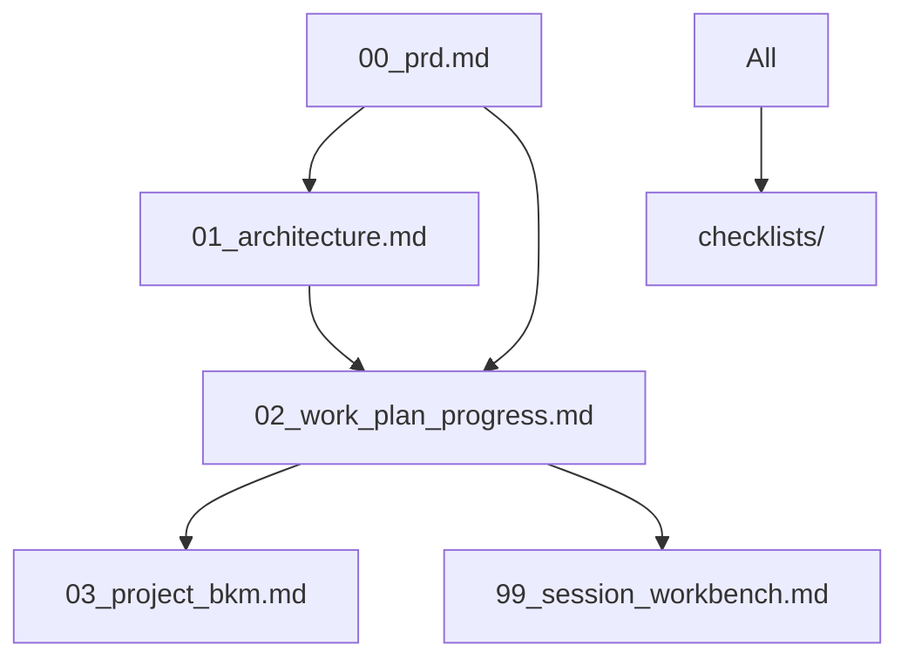

# C语言智能代码分析调试工具 - 项目文档索引

## 项目概述

**Code Repo Learner** 是一个基于AI的C语言代码分析调试工具，结合Tree-sitter语法分析、Neo4j图数据库和LLM智能问答技术，为开发者提供智能的代码理解和调试助手。

## 核心文档导航

### 📋 1. 产品需求文档 (PRD)
**文件:** [00_prd.md](00_prd.md)
**用途:** 项目的单一事实来源，包含所有需求、功能规格和验收标准
**关键内容:**
- 项目目标和用户需求
- 5个核心Epic功能模块
- 技术约束和成功指标
- 项目风险和假设

**👥 适用对象:** 产品经理、开发者、用户
**🔄 维护频率:** 需求变更时

---

### 🏗️ 2. 技术架构文档
**文件:** [01_architecture.md](01_architecture.md)
**用途:** 系统技术架构设计，指导开发实施
**关键内容:**
- 模块化单体架构设计
- **分离式LLM架构:**
  - 本地embedding模型 (jina-embeddings-v2-base-code)
  - OpenRouter对话模型 (API调用)
- Neo4j图数据库设计
- Chroma向量数据库配置

**👥 适用对象:** 架构师、开发者
**🔄 维护频率:** 架构变更时

---

### 📅 3. 工作计划与进度跟踪
**文件:** [02_work_plan_progress.md](02_work_plan_progress.md)
**用途:** Epic分解为Story的详细执行计划
**关键内容:**
- 22个Story的TDD开发计划
- 测试驱动开发(TDD)框架
- **调整后的开发环境:**
  - uv虚拟环境 + flake8 + mypy
  - 本地开发，无GitHub Actions
- 进度跟踪和里程碑

**👥 适用对象:** 开发者、项目经理
**🔄 维护频率:** 每个Story完成后

---

### 📚 4. 项目知识库 (BKM)
**文件:** [03_project_bkm.md](03_project_bkm.md)
**用途:** 最佳实践、技术决策和学习总结
**关键内容:**
- 技术选择的决策理由
- 开发过程中的经验教训
- 常见问题和解决方案
- 性能优化策略

**👥 适用对象:** 开发者、维护者
**🔄 维护频率:** 重要决策和经验产生时

---

### 🔧 5. 当前工作台
**文件:** [99_session_workbench.md](99_session_workbench.md)
**用途:** 当前开发会话的工作空间和上下文
**关键内容:**
- 当前正在进行的Story
- 实施计划和技术细节
- 会话间的上下文传递
- 下一步行动计划

**👥 适用对象:** 当前开发者、AI助手
**🔄 维护频率:** 每个开发会话

## 质量保证检查清单

### ✅ 质量门控文档
**目录:** [checklists/](checklists/)

#### 📋 PRD评审检查清单
**文件:** [checklists/prd_review_checklist.md](checklists/prd_review_checklist.md)
- 需求完整性检查
- 用户故事验证
- 技术可行性评估

#### 🏗️ 架构评审检查清单  
**文件:** [checklists/architecture_review_checklist.md](checklists/architecture_review_checklist.md)
- 架构原则检查
- 技术栈合理性评估
- 性能和安全性验证

#### ✅ Story完成标准检查清单
**文件:** [checklists/story_dod_checklist.md](checklists/story_dod_checklist.md)
- TDD实施质量检查
- 代码质量标准 (flake8 + mypy)
- 测试覆盖率要求 (>90%)

## AI助手使用指南

### 🤖 CursorRIPER框架状态
- **当前阶段:** DEVELOPMENT (START阶段已完成)
- **当前模式:** EXECUTE 
- **已完成Story:** Epic 1, Story 1.1 ✅, Story 1.2 ✅, Story 1.3 ✅
- **下一个Story:** Epic 1, Story 1.4 (向量嵌入与问答)

### 📖 AI上下文加载顺序
1. **核心文档:** 按数字顺序读取 (00 → 01 → 02 → 03)
2. **工作台:** 查看99_session_workbench.md了解当前状态  
3. **质量标准:** 检查相关checklist了解标准

### 🔄 开发工作流


## 用户使用指南

### 🚀 快速开始
1. **了解项目:** 阅读 [00_prd.md](00_prd.md)
2. **技术架构:** 查看 [01_architecture.md](01_architecture.md)
3. **开发计划:** 参考 [02_work_plan_progress.md](02_work_plan_progress.md)
4. **当前进度:** 检查 [99_session_workbench.md](99_session_workbench.md)

### 📈 进度跟踪
- **Epic完成情况:** 查看工作计划中的进度表
- **当前焦点:** 工作台文档显示当前开发重点
- **质量状态:** 检查清单显示质量门控通过情况

### 🔧 开发环境
**本地开发环境要求:**
- Python 3.8+
- uv (虚拟环境管理)
- flake8 (代码风格)
- mypy (类型检查)
- Neo4j (图数据库)
- 足够的本地计算资源 (运行embedding模型)

## 文档维护指南

### 📝 更新原则
1. **PRD优先:** 任何功能变更都要先更新PRD
2. **架构同步:** 技术决策要同步更新架构文档
3. **进度实时:** 工作计划要反映实际进度
4. **知识积累:** 重要经验要记录到BKM

### 🔗 文档间关系


### 📊 质量标准
- 所有文档都要通过对应的检查清单验证
- 文档要保持与代码实现的一致性
- 更新要有版本记录和变更说明

---

## 快速链接

| 文档类型 | 主要文件 | 用途 | 读者 |
|----------|----------|------|------|
| 📋 需求 | [PRD](00_prd.md) | 功能规格 | 全员 |
| 🏗️ 架构 | [Architecture](01_architecture.md) | 技术设计 | 开发者 |
| 📅 计划 | [Work Plan](02_work_plan_progress.md) | 开发规划 | 开发者 |
| 📚 知识 | [BKM](03_project_bkm.md) | 最佳实践 | 维护者 |
| 🔧 工作台 | [Workbench](99_session_workbench.md) | 当前状态 | AI助手 |
| ✅ 质量 | [Checklists](checklists/) | 标准检查 | 评审者 |

---

**文档版本:** v1.3
- **最后更新:** 2025-06-25  
**维护者:** AI Assistant + User

## 最新更新 (v1.3 - 2025-06-25)

### ✅ Story 2.1 完成 (函数调用关系分析)
- **数据模型扩展:** 实现了FunctionCall数据类，支持direct、member、pointer、recursive四种调用类型
- **函数调用提取:** 基于Tree-sitter AST实现精确的函数调用提取，支持四种调用类型识别
- **Neo4j存储扩展:** 实现CALLS关系存储，支持调用类型和上下文信息
- **调用图谱可视化:** 支持Mermaid、JSON、ASCII、HTML四种格式的调用图谱可视化
- **CLI工具:** 实现call-graph命令行工具，支持多种输出格式和文件导出

### 📊 Epic 2 进度
- **Story 2.1.1:** ✅ 完成 (接口设计扩展)
- **Story 2.1.2:** ✅ 完成 (数据模型扩展实现)
- **Story 2.1.3:** ✅ 完成 (解析器增强 - 函数调用提取)
- **Story 2.1.4:** ✅ 完成 (调用图谱可视化服务)
- **Story 2.2:** 🔄 下一步 (依赖关系分析)

### 🔍 Story 2.2 规划 (依赖关系分析)
- **头文件依赖:** 提取#include语句，构建文件依赖图
- **模块依赖:** 基于目录结构分析模块间依赖关系
- **循环依赖检测:** 识别项目中的循环依赖问题
- **依赖可视化:** 生成文件和模块级别的依赖图谱
- **预计工作量:** 0.7天，计划本周完成

### 🔧 技术栈验证状态
- ✅ **Python 3.11.12 + uv环境:** 完全配置
- ✅ **Tree-sitter 0.21.3 + tree-sitter-c 0.21.3:** API兼容性解决
- ✅ **配置管理系统:** ConfigManager单例模式实现
- ✅ **数据模型和接口:** 完整的SOLID架构
- ✅ **Neo4j图数据库:** 完整集成，严格模式运行
- ✅ **调用图谱可视化:** Mermaid.js集成，支持多种格式
- 🔄 **Chroma向量数据库:** 准备集成
- 📅 **OpenRouter API:** 待集成

## Neo4j图数据库使用指南

### 🚀 快速启动Neo4j

**1. 启动Neo4j容器:**
```bash
docker run -d \
    --name neo4j-community \
    --restart always \
    -p 7474:7474 -p 7687:7687 \
    -v neo4j_data:/data \
    -v neo4j_logs:/logs \
    -e NEO4J_AUTH=neo4j/your_password \
    neo4j:5.26-community
```

**2. 配置环境变量:**
```bash
# .env文件
NEO4J_PASSWORD=your_password
NEO4J_URI=bolt://localhost:7687
NEO4J_USER=neo4j
VERBOSE=true  # 开启详细日志
```

### 🧪 测试Neo4j集成

**运行验收测试:**
```bash
# 基本测试
python -m pytest tests/integration/test_story_1_3_acceptance.py -v

# 详细日志模式  
VERBOSE=true python -m pytest tests/integration/test_story_1_3_acceptance.py -v -s
```

**测试覆盖:**
- ✅ Neo4j连接和基本操作
- ✅ 存储File和Function节点
- ✅ 创建CONTAINS关系
- ✅ 端到端真实C文件测试

### 🔍 Neo4j Web界面使用

**访问界面:**
- URL: http://localhost:7474
- 登录: neo4j / your_password

**常用查询示例:**
```cypher
// 查看所有节点和关系
MATCH (n) RETURN n LIMIT 25

// 查看文件包含的函数
MATCH (f:File)-[:CONTAINS]->(fn:Function) 
RETURN f.name, fn.name, fn.start_line, fn.end_line

// 统计节点数量
MATCH (n) RETURN labels(n) as type, count(n) as count

// 查找特定函数
MATCH (fn:Function {name: "main"}) 
RETURN fn.name, fn.code, fn.start_line, fn.file_path

// 查看文件的所有函数
MATCH (f:File {name: "hello.c"})-[:CONTAINS]->(fn:Function)
RETURN fn.name, fn.start_line ORDER BY fn.start_line
```

### ⚠️ 故障排除

**常见问题:**

1. **连接失败 - StorageError: connection_unavailable**
   ```bash
   # 检查Neo4j容器状态
   docker ps | grep neo4j
   docker logs neo4j-community
   
   # 重启容器
   docker restart neo4j-community
   ```

2. **认证失败 - StorageError: authentication_failed**  
   ```bash
   # 检查环境变量
   echo $NEO4J_PASSWORD
   
   # 重置密码
   docker exec neo4j-community neo4j-admin dbms set-initial-password new_password
   ```

3. **事务失败 - StorageError: transaction_execution**
   ```bash
   # 开启verbose模式查看详细错误
   VERBOSE=true python your_script.py
   
   # 清空数据库重新开始
   # 在Neo4j Browser中执行: MATCH (n) DETACH DELETE n
   ```

### 📊 性能特性

**连接池配置:**
- 最大连接数: 50
- 连接超时: 60秒
- 自动重连: 支持

**批量操作:**
- 使用UNWIND批量创建节点
- 事务安全保证数据一致性
- 支持大文件和多函数处理

**严格模式特性:**
- 无Fallback机制 - 所有错误抛出异常
- 详细日志记录 - VERBOSE模式完整跟踪
- 事务验证 - 操作完成度检查

---

*这个索引文档帮助AI助手和用户快速导航项目文档，理解项目当前状态和下一步行动。* 